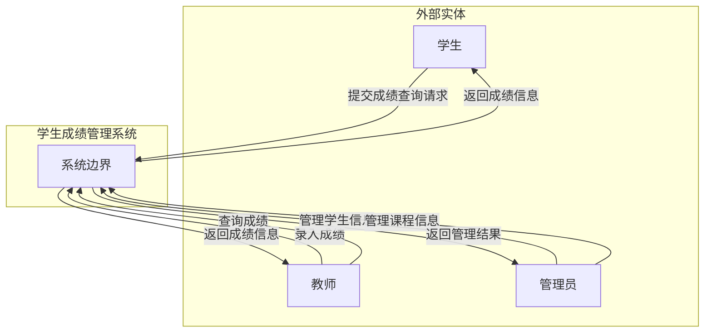
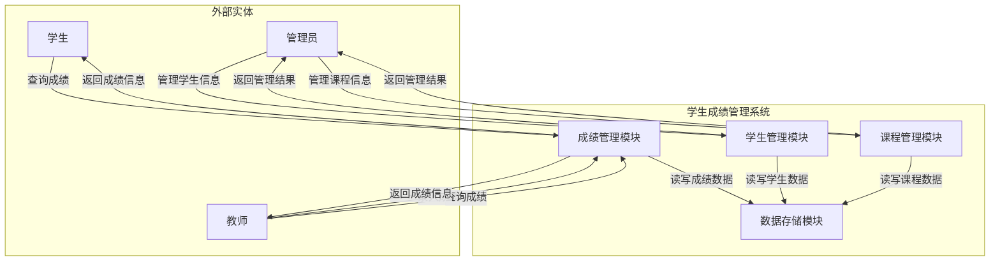
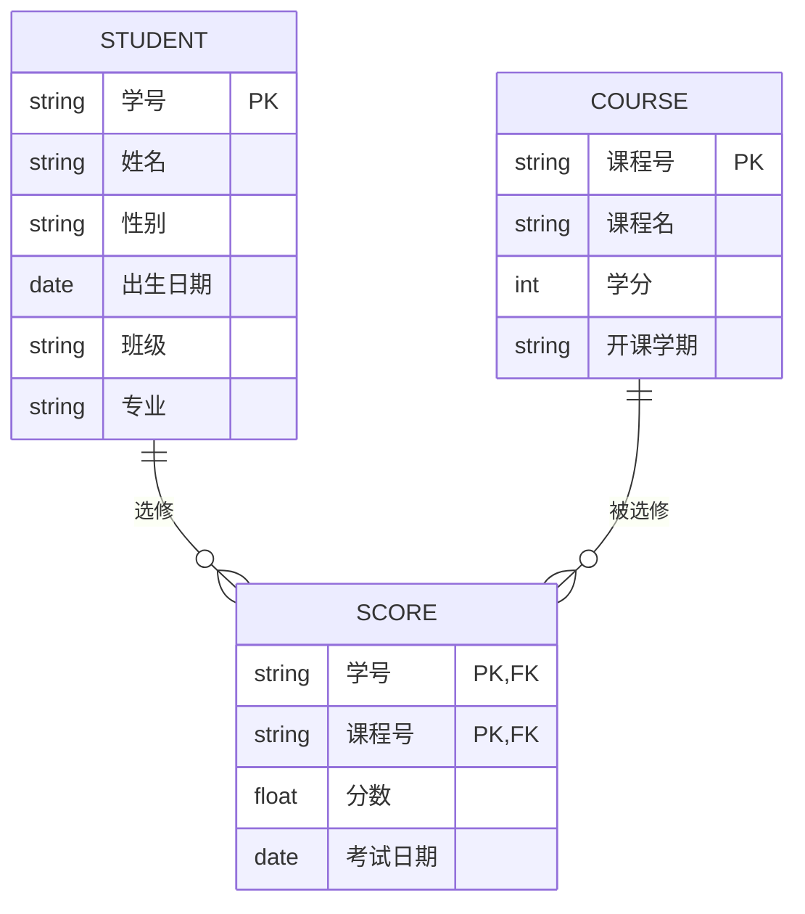
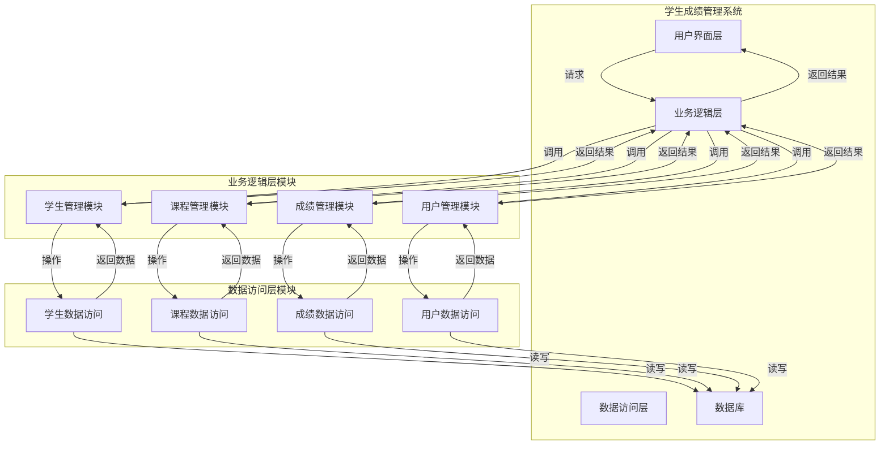
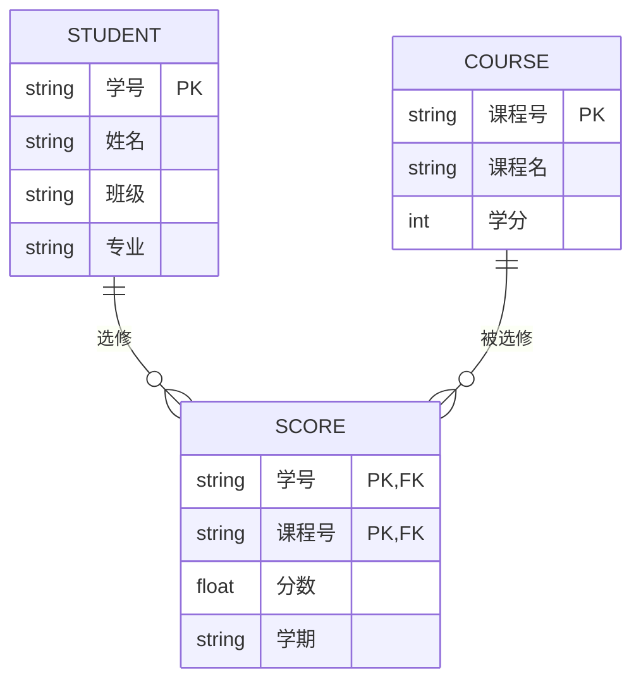

# 实验报告：结构化方法实践

## 实验基本信息

| 项目 | 内容 |
|------|------|
| **实验名称** | 学生成绩管理系统结构化分析与设计 |
| **实验周次** | 第 2 周 |
| **实验日期** | 2026 年 3 月 23 日 |
| **学生姓名** | 阳奇 |
| **学号** | 202442020128 |
| **班级** | 2024级软件工程1班 |
| **指导教师** | 李莹 |

---

## 一、实验目的

1. 掌握结构化方法的基本原理和应用
2. 学习使用Mermaid语法绘制数据流图（DFD）和实体关系图（ER图）
3. 理解数据字典的设计和使用方法
4. 掌握SQL建表语句的编写，包括主键和外键约束
5. 学习系统模块结构的设计和划分

---

## 二、实验环境

### 2.1 硬件环境

| 项目 | 配置 |
|------|------|
| 计算机型号 | LENOVO 83DG |
| CPU | Intel(R) Core(TM) i7-14650HX (16核24线程) |
| 内存 | 16GB |
| 硬盘 | C盘: 300GB, D盘: 650GB |

### 2.2 软件环境

| 软件 | 版本 |
|------|------|
| 操作系统 | Microsoft Windows 11 专业版 (10.0.26200) |
| Rust | 1.93.1 (01f6ddf75 2026-02-11) |
| Git | 2.45.2.windows.1 (安装在D:\Git\Git\) |
| IDE | Trae IDE |

---

## 三、实验内容

### 3.1 任务描述

本次实验需要完成学生成绩管理系统的结构化分析与设计，包括：
1. 绘制DFD上下文图和Level 1图
2. 设计ER图
3. 创建数据字典
4. 编写SQL建表语句
5. 设计模块结构图

### 3.2 实验步骤

#### 步骤1：生成DFD图

**操作命令/代码**：
```bash
# 使用Mermaid语法生成DFD上下文图和Level 1图
```

**Mermaid代码**：

**DFD上下文图**：


**DFD Level 1图**：


**执行结果**：


**结果分析**：
成功生成了DFD上下文图和Level 1图，展示了系统与外部实体的交互关系以及内部模块的数据流动。上下文图清晰展示了系统与学生、教师、管理员三个外部实体的交互；Level 1图详细分解了系统内部的成绩管理、学生管理、课程管理和数据存储四个模块的功能和数据流向。

---

#### 步骤2：生成ER图

**操作命令/代码**：
```bash
# 使用Mermaid语法生成ER图
```

**Mermaid代码**：


**执行结果**：


**结果分析**：
成功生成了ER图，展示了学生、课程和成绩三个实体之间的关系，正确建立了多对多关系。ER图清晰表达了实体的属性和实体间的关联关系，为数据库设计提供了直观的参考。

---

#### 步骤3：创建数据字典和SQL建表语句

**操作命令/代码**：
```bash
# 创建SQL文件
New-Item -ItemType Directory -Path "docs\requirements" -Force
New-Item -ItemType File -Path "docs\requirements\student_system.sql" -Force
# 编写SQL建表语句
```

**数据字典**：

| 表名 | 字段名 | 数据类型 | 长度 | 约束 | 描述 |
|------|--------|----------|------|------|------|
| student | 学号 | VARCHAR | 20 | PRIMARY KEY | 学生唯一标识 |
| student | 姓名 | VARCHAR | 50 | NOT NULL | 学生姓名 |
| student | 性别 | VARCHAR | 10 | NOT NULL | 学生性别 |
| student | 出生日期 | DATE | - | NOT NULL | 学生出生日期 |
| student | 班级 | VARCHAR | 50 | NOT NULL | 学生所在班级 |
| student | 专业 | VARCHAR | 100 | NOT NULL | 学生所属专业 |
| course | 课程号 | VARCHAR | 20 | PRIMARY KEY | 课程唯一标识 |
| course | 课程名 | VARCHAR | 100 | NOT NULL | 课程名称 |
| course | 学分 | INT | - | NOT NULL | 课程学分 |
| course | 开课学期 | VARCHAR | 20 | NOT NULL | 课程开设学期 |
| score | 学号 | VARCHAR | 20 | PRIMARY KEY, FOREIGN KEY | 关联学生表的学号 |
| score | 课程号 | VARCHAR | 20 | PRIMARY KEY, FOREIGN KEY | 关联课程表的课程号 |
| score | 分数 | FLOAT | - | NOT NULL | 学生课程成绩 |
| score | 考试日期 | DATE | - | NOT NULL | 考试日期 |

**执行结果**：
生成了完整的数据字典和SQL建表语句，包含了所有必要的字段和约束。

**结果分析**：
数据字典和SQL建表语句符合系统需求，包含了正确的字段定义、主键和外键约束。SQL语句使用了InnoDB引擎，支持外键约束，确保了数据的完整性。数据字典详细定义了每个表的字段、数据类型、长度、约束和描述，为系统设计提供了清晰的数据结构参考。

---

#### 步骤4：生成模块结构图

**操作命令/代码**：
```bash
# 在Markdown文件中编写模块结构图的Mermaid代码
```

**Mermaid代码**：


**执行结果**：


**结果分析**：
成功生成了模块结构图，展示了系统的模块划分和调用关系。系统采用了四层架构：用户界面层、业务逻辑层、数据访问层和数据库。业务逻辑层细分为学生管理、课程管理、成绩管理和用户管理四个模块，数据访问层对应分为四个数据访问模块，清晰展示了系统的架构设计和模块间的调用关系，为系统的实现提供了清晰的结构参考。

---

## 四、实验结果

### 4.1 完成情况

| 任务 | 完成情况 | 说明 |
|------|----------|------|
| DFD图生成 | ☑ 完成 □ 未完成 | 生成了上下文图和Level 1图 |
| ER图设计 | ☑ 完成 □ 未完成 | 设计了包含三个实体的ER图 |
| 数据字典创建 | ☑ 完成 □ 未完成 | 创建了完整的数据字典 |
| SQL建表语句编写 | ☑ 完成 □ 未完成 | 编写了包含约束的建表语句 |
| 模块结构图设计 | ☑ 完成 □ 未完成 | 设计了系统模块结构图 |

### 4.2 关键成果

1. DFD上下文图和Level 1图，展示了系统与外部实体的交互
2. ER图，展示了实体之间的关系
3. 数据字典，定义了系统的所有数据字段
4. SQL建表语句，包含了主键和外键约束
5. 模块结构图，展示了系统的模块划分和调用关系

### 4.3 代码提交

| 项目 | 内容 |
|------|------|
| 分支名称 | main |
| 提交哈希 | fd948a0 |
| PR链接 | N/A |

---

## 五、遇到的问题与解决

### 5.1 问题记录

| 序号 | 问题描述 | 解决方法 | 参考资料 |
|------|----------|----------|----------|
| 1 | Mermaid语法不熟悉 | 查阅Mermaid官方文档，学习基本语法 | https://mermaid.js.org/ |
| 2 | 外键约束的设置 | 学习MySQL外键约束的语法和使用方法 | MySQL官方文档 |
| 3 | 模块之间的调用关系设计 | 分析系统功能，确定模块间的依赖关系 | 软件工程教材 |

### 5.2 问题分析

在实验过程中，主要遇到了Mermaid语法使用、外键约束设置和模块关系设计的问题。通过查阅相关文档和资料，成功解决了这些问题，确保了实验的顺利完成。

---

## 六、实验总结

### 6.1 知识收获

1. 掌握了结构化方法的基本原理和应用
2. 学习了Mermaid语法的使用，能够绘制DFD图和ER图
3. 理解了数据字典的设计方法和重要性
4. 掌握了SQL建表语句的编写，包括主键和外键约束
5. 学习了系统模块结构的设计和划分方法

### 6.2 技能提升

1. 提高了系统分析和设计能力
2. 掌握了使用Mermaid绘制图表的技能
3. 提升了SQL语句编写能力
4. 增强了系统模块设计能力

### 6.3 心得体会

通过本次实验，我深刻理解了结构化方法在系统设计中的重要性。使用Mermaid语法绘制图表和编写SQL建表语句的过程，让我更加熟悉了系统设计的流程和方法。同时，通过解决实验过程中遇到的问题，我也提高了自己的问题解决能力。

### 6.4 改进建议

1. 可以增加更多的系统功能模块，如用户管理、权限控制等
2. 可以进一步优化数据库设计，增加更多的约束和索引
3. 可以使用专业的系统设计工具，提高设计效率和质量

---

## 七、AI工具使用记录

### 7.1 AI工具使用情况

| AI工具 | 使用场景 | 效果评价 |
|--------|----------|----------|
| 代码助手 | 生成Mermaid图表代码 | 高效准确 |
| 代码助手 | 生成SQL建表语句 | 规范完整 |
| 代码助手 | 生成数据字典 | 结构清晰 |

### 7.2 AI辅助示例

**输入提示词**：
```
请为"学生成绩管理系统"生成ER图，使用Mermaid语法。
实体包括：
1. 学生(Student)：学号、姓名、班级、专业
2. 课程(Course)：课程号、课程名、学分
3. 成绩(Score)：学号、课程号、分数、学期

关系：
- 一个学生可以选修多门课程
- 一门课程可以被多个学生选修
- 成绩关联学生和课程

请输出Mermaid ER图代码。
```

**AI输出结果**：


**使用效果**：
AI输出的ER图代码结构清晰，正确表达了实体之间的关系，使用起来非常方便。

---

## 八、参考资料

1. Mermaid官方文档：https://mermaid.js.org/
2. MySQL官方文档
3. 软件工程教材

---

## 九、教师评语

（教师填写）

| 评价项目 | 得分 |
|----------|------|
| 实验完成度 | /40 |
| 报告规范性 | /20 |
| 问题解决能力 | /20 |
| 创新性 | /10 |
| 总结深度 | /10 |
| **总分** | **/100** |

**教师签名**：________________    **日期**：________________

---

## 附录

### 附录A：完整代码

```sql
-- 创建学生表
CREATE TABLE `student` (
  `学号` VARCHAR(20) NOT NULL,
  `姓名` VARCHAR(50) NOT NULL,
  `性别` VARCHAR(10) NOT NULL,
  `出生日期` DATE NOT NULL,
  `班级` VARCHAR(50) NOT NULL,
  `专业` VARCHAR(100) NOT NULL,
  PRIMARY KEY (`学号`)
) ENGINE=InnoDB DEFAULT CHARSET=utf8mb4 COLLATE=utf8mb4_unicode_ci;

-- 创建课程表
CREATE TABLE `course` (
  `课程号` VARCHAR(20) NOT NULL,
  `课程名` VARCHAR(100) NOT NULL,
  `学分` INT NOT NULL,
  `开课学期` VARCHAR(20) NOT NULL,
  PRIMARY KEY (`课程号`)
) ENGINE=InnoDB DEFAULT CHARSET=utf8mb4 COLLATE=utf8mb4_unicode_ci;

-- 创建成绩表
CREATE TABLE `score` (
  `学号` VARCHAR(20) NOT NULL,
  `课程号` VARCHAR(20) NOT NULL,
  `分数` FLOAT NOT NULL,
  `考试日期` DATE NOT NULL,
  PRIMARY KEY (`学号`, `课程号`),
  FOREIGN KEY (`学号`) REFERENCES `student` (`学号`) ON DELETE CASCADE ON UPDATE CASCADE,
  FOREIGN KEY (`课程号`) REFERENCES `course` (`课程号`) ON DELETE CASCADE ON UPDATE CASCADE
) ENGINE=InnoDB DEFAULT CHARSET=utf8mb4 COLLATE=utf8mb4_unicode_ci;
```

### 附录B：运行日志

```
// 在此粘贴完整的运行日志
```

### 附录C：相关截图

（在此粘贴实验过程中的关键截图）

---

**报告提交日期**：2026年3月23日
**学生签名**：______阳奇__________