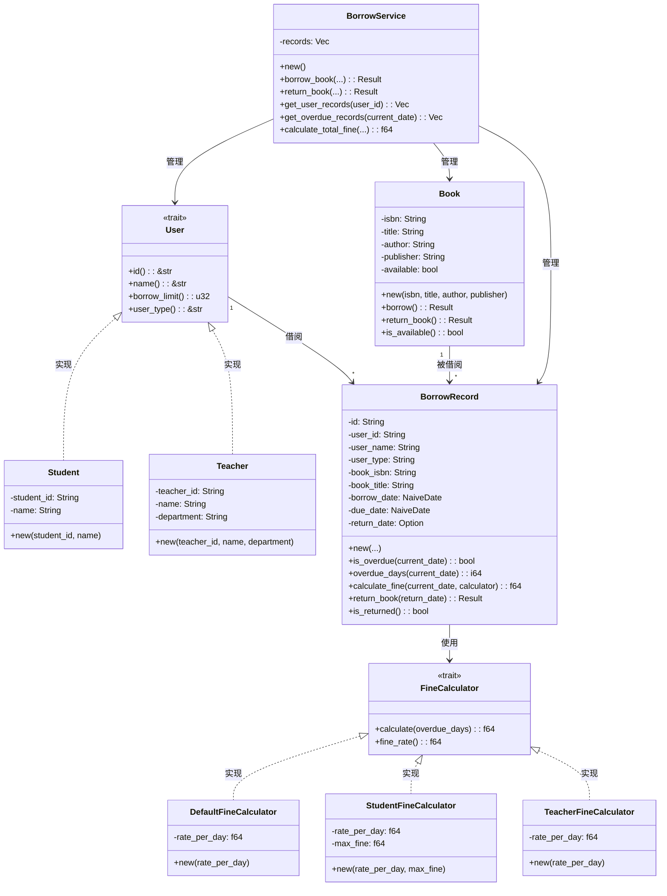

# 实验报告

| 课程名称 | 面向对象分析与设计 | 实验名称 | 高校图书借阅系统设计与实现 |
|---------|------------------|---------|--------------------------|
| 实验时间 | 2026年4月3日 | 实验类型 | 设计性实验 |
| 实验学时 | 2学时 | 班级 | 24软工1班|
| 姓名 | 阳奇 | 学号 | 202442020128 |

---

## 一、实验目的

1. 掌握面向对象分析（OOA）方法，能够从需求中识别核心对象和关系
2. 掌握面向对象设计（OOD）方法，能够设计合理的类结构和交互关系
3. 理解并应用 SOLID 设计原则，提高代码质量和可维护性
4. 能够使用 Mermaid 绘制标准的类图
5. 掌握 Rust 语言中实现面向对象设计的方法

---

## 二、实验环境

### 2.1 硬件环境

| 项目 | 配置 |
|------|------|
| 计算机型号 | LENOVO 83DG |
| CPU | Intel(R) Core(TM) i7-14650HX (16核24线程) |
| 内存 | 16GB |
| 硬盘 | C盘: 300GB, D盘: 650GB |

### 2.2 软件环境

| 软件 | 版本 |
|------|------|
| 操作系统 | Microsoft Windows 11 专业版 (10.0.26200) |
| Rust | 1.93.1 (01f6ddf75 2026-02-11) |
| Git | 2.45.2.windows.1 |
| IDE | Trae IDE |
| 依赖库 | chrono 0.4, serde 1.0 |
| 类图工具 | Mermaid |

---

## 三、实验内容与步骤

### 3.1 需求分析（面向对象分析 OOA）

**步骤1：提取名词**
从需求描述中提取所有名词，分类如下：

| 类别 | 名词 |
|------|------|
| 角色 | 学生、教师、图书管理员 |
| 实体 | 图书、ISBN、书名、作者、出版社 |
| 业务 | 借阅人、借阅日期、应还日期、借阅记录、借阅历史、逾期罚款 |

**步骤2：筛选核心对象**
根据业务重要性和职责边界，筛选出以下核心对象：

| 对象 | 类型 | 说明 |
|------|------|------|
| User | 抽象接口 | 学生和教师的公共行为抽象 |
| Student | 实体类 | 学生用户，借阅上限5本 |
| Teacher | 实体类 | 教师用户，借阅上限10本 |
| Book | 实体类 | 图书信息，包含借阅状态 |
| BorrowRecord | 实体类 | 借阅记录，包含逾期判断 |
| FineCalculator | 接口 | 罚款计算策略 |
| BorrowService | 服务类 | 借阅业务逻辑 |

**步骤3：确定对象关系**

```
User (trait) <|.. Student
User (trait) <|.. Teacher
User "1" --> "*" BorrowRecord : 借阅
Book "1" --> "*" BorrowRecord : 被借阅
BorrowRecord --> FineCalculator : 计算罚款
BorrowService --> User : 管理
BorrowService --> Book : 管理
BorrowService --> BorrowRecord : 管理
```

### 3.2 类图设计（面向对象设计 OOD）

**步骤1：设计类结构**
使用 Mermaid 绘制完整类图：



**步骤2：应用 SOLID 原则**

| 原则 | 应用方式 | 示例 |
|------|----------|------|
| 单一职责 | 每个类只负责一个功能 | `Book` 只管理图书信息和状态 |
| 开闭原则 | 通过 trait 定义扩展点 | 新增用户类型无需修改现有代码 |
| 里氏替换 | 子类可替换父类使用 | `Student` 和 `Teacher` 可替换 `User` |
| 接口隔离 | 接口只包含必要方法 | `User` trait 只定义核心行为 |
| 依赖倒置 | 依赖抽象而非实现 | `BorrowService` 依赖 `User` trait |

### 3.3 代码实现

**步骤1：创建项目结构**

```
library/
├── Cargo.toml
├── src/
│   ├── main.rs              # 程序入口，演示功能
│   ├── models/
│   │   ├── mod.rs           # 模块导出
│   │   ├── user.rs          # User trait, Student, Teacher
│   │   ├── book.rs          # Book 结构体
│   │   ├── borrow_record.rs # BorrowRecord 结构体
│   │   └── fine_calculator.rs # FineCalculator trait 及实现
│   └── services/
│       ├── mod.rs           # 模块导出
│       └── borrow_service.rs # BorrowService 服务类
```

**步骤2：实现核心功能**

1. **User 接口及实现**
   - 定义 `User` trait，包含 `id()`、`name()`、`borrow_limit()`、`user_type()` 方法
   - 实现 `Student` 和 `Teacher` 结构体

2. **Book 类**
   - 实现 `borrow()` 和 `return_book()` 方法，包含状态检查

3. **BorrowRecord 类**
   - 实现 `is_overdue()` 方法判断是否逾期
   - 实现 `calculate_fine()` 方法计算罚款

4. **FineCalculator 策略**
   - 定义 `FineCalculator` trait
   - 实现不同用户类型的罚款策略

5. **BorrowService 服务**
   - 实现借阅、归还、查询等业务逻辑

**步骤3：编写测试用例**
为每个模块编写单元测试，确保功能正确性。

---

## 四、实验结果

### 4.1 代码编译情况

| 模块 | 编译状态 | 测试结果 |
|------|----------|----------|
| user.rs | ✅ 编译通过 | ✅ 测试通过 |
| book.rs | ✅ 编译通过 | ✅ 测试通过 |
| borrow_record.rs | ✅ 编译通过 | ✅ 测试通过 |
| fine_calculator.rs | ✅ 编译通过 | ✅ 测试通过 |
| borrow_service.rs | ✅ 编译通过 | ✅ 测试通过 |
| main.rs | ✅ 编译通过 | ✅ 运行正常 |

### 4.2 功能演示

**演示场景**：
1. 创建学生和教师用户
2. 创建图书并进行借阅操作
3. 模拟逾期情况并计算罚款
4. 执行归还操作
5. 查看借阅历史

**运行结果**：
- 成功实现图书借阅、归还功能
- 正确计算逾期罚款
- 完整记录借阅历史
- 支持不同用户类型的借阅上限

### 4.3 核心代码片段

#### 4.3.1 User 接口定义

```rust
pub trait User {
    fn id(&self) -> &str;
    fn name(&self) -> &str;
    fn borrow_limit(&self) -> u32;
    fn user_type(&self) -> &str;
}
```

#### 4.3.2 Book 借阅方法

```rust
pub fn borrow(&mut self) -> Result<(), String> {
    if self.available {
        self.available = false;
        Ok(())
    } else {
        Err(format!("图书《{}》已被借出，无法再次借阅", self.title))
    }
}
```

#### 4.3.3 逾期判断逻辑

```rust
pub fn is_overdue(&self, current_date: NaiveDate) -> bool {
    if let Some(returned) = self.return_date {
        returned > self.due_date
    } else {
        current_date > self.due_date
    }
}
```

---

## 五、实验心得与总结

### 5.1 实验收获

1. **面向对象分析能力**：通过"名词提取法"从需求中识别核心对象，掌握了 OOA 的基本方法。理解了如何从业务需求中抽象出实体、关系和行为。

2. **面向对象设计能力**：学习了如何设计合理的类结构，包括：
   - 如何定义接口和实现类
   - 如何设计类之间的关系
   - 如何应用设计模式（如策略模式）

3. **SOLID 原则应用**：
   - **单一职责**：每个类只负责一个功能，提高了代码的可维护性
   - **开闭原则**：通过 trait 实现扩展点，使系统更灵活
   - **依赖倒置**：依赖抽象而非具体实现，降低了模块间耦合

4. **Rust 语言实践**：
   - 掌握了 Rust 中使用 trait 实现接口的方法
   - 理解了 Rust 的所有权系统和借用规则
   - 学会了使用 Result 类型处理错误

### 5.2 遇到的问题与解决方法

| 问题 | 解决方法 |
|------|----------|
| 日期处理 | 使用 chrono 库处理日期计算 |
| 错误处理 | 使用 Result 类型和 match 表达式 |
| 多态实现 | 使用 trait object (`&dyn Trait`) |
| 策略模式 | 通过 trait 定义不同的罚款计算策略 |

### 5.3 改进方向

1. **数据持久化**：添加数据库存储功能，实现数据的持久化
2. **用户界面**：开发命令行或图形界面，提高用户体验
3. **权限管理**：添加图书管理员角色，实现更细粒度的权限控制
4. **预约功能**：增加图书预约功能，提高系统的实用性
5. **性能优化**：优化数据结构和算法，提高系统性能

---

## 六、思考题

### 6.1 为什么要先 OOA 再 OOD？

**回答**：面向对象分析（OOA）关注"做什么"，即识别问题域中的对象、属性和关系；面向对象设计（OOD）关注"怎么做"，即确定类的具体实现、方法和交互方式。先进行 OOA 可以确保我们正确理解业务需求，避免在设计阶段遗漏重要概念或引入不必要的复杂性。OOA 为 OOD 提供了清晰的问题边界和设计依据。

### 6.2 如何判断类的职责是否单一？

**回答**：判断类的职责是否单一可以从以下几个方面考虑：
- **变化理由**：类是否只有一个引起它变化的理由
- **职责描述**：类名是否能准确描述其核心职责
- **方法相关性**：类的所有方法是否都围绕同一核心概念
- **修改影响**：修改类的一个部分是否会影响其他不相关的部分
- **可测试性**：类是否容易进行单元测试

### 6.3 如果新增"预约"功能，如何修改类图？

**回答**：新增预约功能需要进行以下修改：

1. **添加 `Reservation` 类**：
   - 属性：预约ID、用户ID、图书ISBN、预约日期、状态等
   - 方法：创建预约、取消预约、查询预约状态等

2. **修改 `Book` 类**：
   - 添加 `is_reserved()` 方法
   - 在 `borrow()` 方法中检查预约状态

3. **添加 `ReservationService` 类**：
   - 管理预约相关业务逻辑
   - 处理预约冲突和过期

4. **更新关系**：
   - `User` 与 `Reservation` 建立一对多关系
   - `Book` 与 `Reservation` 建立一对多关系

5. **修改 `BorrowService`**：
   - 在借阅时检查预约信息
   - 支持从预约状态直接借阅

---

## 七、附录

### 7.1 项目配置文件（Cargo.toml）

```toml
[package]
name = "library_system"
version = "0.1.0"
edition = "2021"

[dependencies]
chrono = { version = "0.4", features = ["serde"] }
serde = { version = "1.0", features = ["derive"] }
```

### 7.2 主要文件清单

| 文件名 | 功能描述 |
|--------|----------|
| src/models/user.rs | 定义 User 接口及 Student、Teacher 实现 |
| src/models/book.rs | 实现 Book 类及借阅、归还方法 |
| src/models/borrow_record.rs | 实现 BorrowRecord 类及逾期判断 |
| src/models/fine_calculator.rs | 实现 FineCalculator 接口及策略 |
| src/services/borrow_service.rs | 实现借阅业务逻辑 |
| src/main.rs | 程序入口，功能演示 |

### 7.3 Git 提交信息

**提交命令**：
```bash
git add .
git commit -m "experiment: week-03 OOAD"
git push origin master
```

**提交内容**：
- 完整的项目结构
- 所有源代码文件
- 实验报告文件

**分支信息**：
- 当前分支：master
- 远程仓库：origin

---

| 指导教师 | ____________ | 实验成绩 | ____________ |
|---------|------------|---------|------------|
| 批改日期 | ____________ | | |
