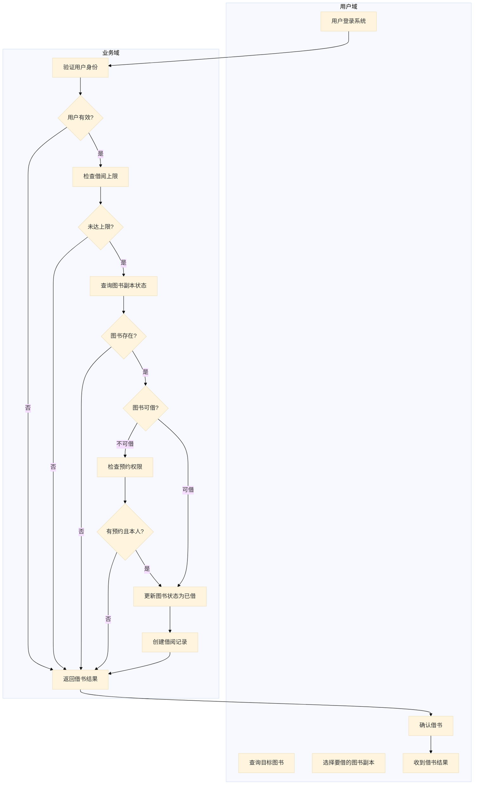
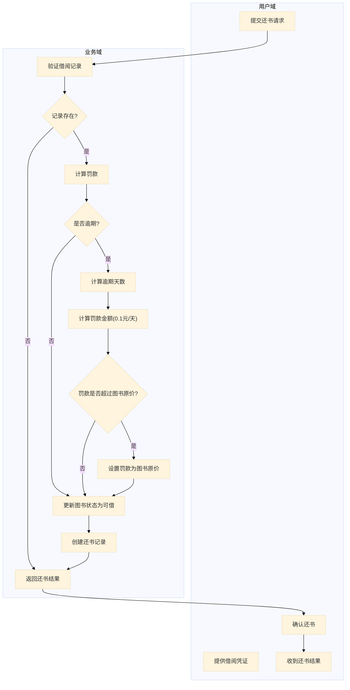
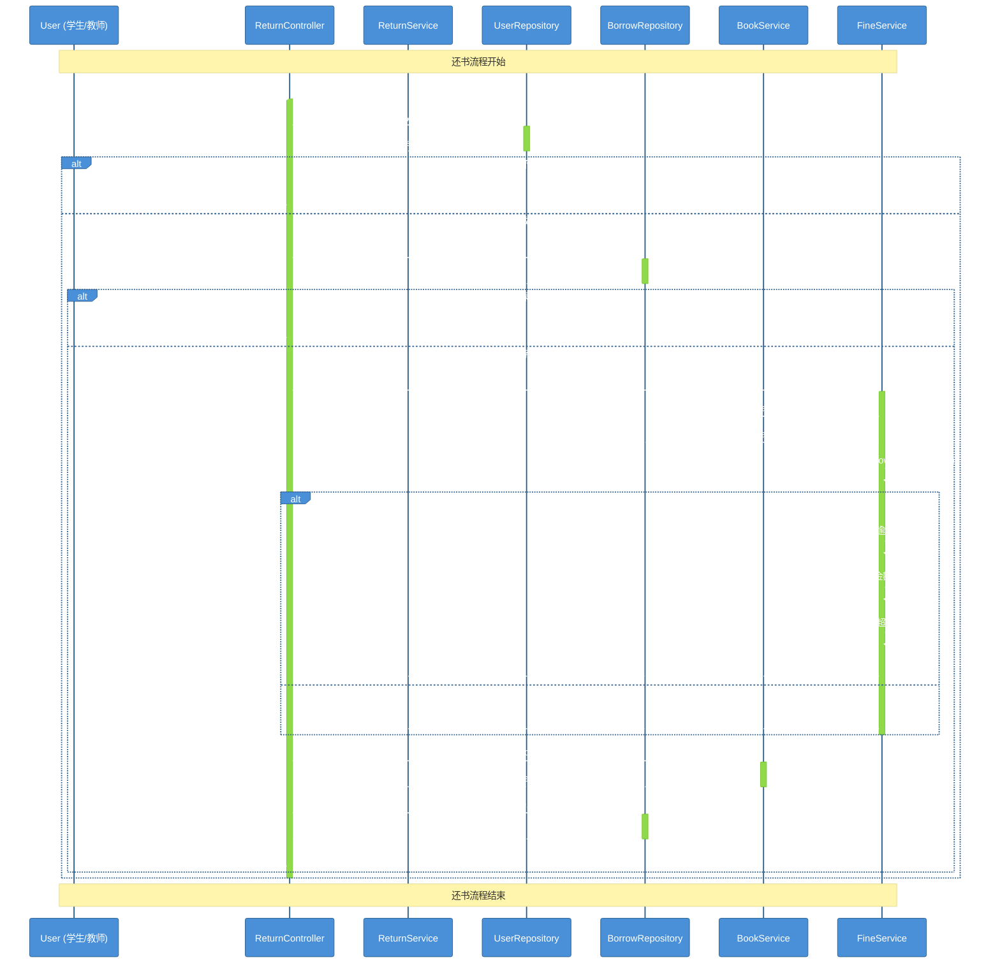
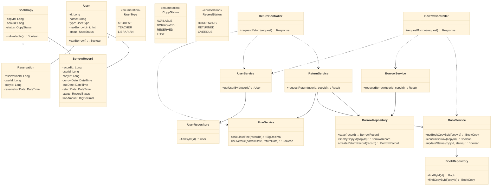
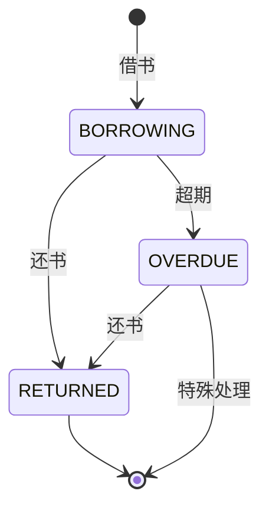

# 实验报告

| 项目 | 内容 |
|------|------|
| **实验名称** | UML建模与OOA-OOD实践 |
| **实验周次** | 第 4 周 |
| **实验日期** | 2026 年 4 月 6 日 |
| **学生姓名** | 阳奇 |
| **学号** | 202442020128 |
| **班级** | 2024级软件工程班1 |
| **指导教师** | 李莹 |
---

## 一、实验目的

1. 掌握用例图绘制方法
2. 掌握活动图绘制方法（流程视角）
3. 理解架构设计的重要性
4. 掌握顺序图绘制方法（对象视角）
5. 掌握类图的更新方法
6. 掌握状态图绘制方法
7. 理解OOA→OOD→OOP的转换过程

---

## 二、实验环境

### 2.1 硬件环境

| 项目 | 配置 |
|------|------|
| 计算机型号 | LENOVO 83DG |
| CPU | Intel(R) Core(TM) i7-14650HX (16核24线程) |
| 内存 | 16GB |
| 硬盘 | C盘: 300GB, D盘: 650GB |

### 2.2 软件环境

| 软件 | 版本 |
|------|------|
| 操作系统 | Microsoft Windows 11 专业版 (10.0.26200) |
| Rust | 1.93.1 (01f6ddf75 2026-02-11) |
| Git | 2.45.2.windows.1 |
| IDE | Trae IDE |
| UML工具 | Mermaid |

---

## 三、实验内容与步骤

### 3.1 用例图

**步骤1：识别参与者**

| 参与者   | 说明                 |
| ----- | ------------------ |
| 学生    | 借书、还书、查询、预约、续借、查看历史   |
| 教师    | 借书、还书、查询、预约、续借、查看历史   |
| 图书管理员 | 管理图书、查看所有借阅记录、管理用户 |

**步骤2：识别用例**

| 用例       | 说明              |
| -------- | --------------- |
| 登录       | 用户身份验证          |
| 查询图书     | 搜索和查看图书信息       |
| 借书       | 借阅图书            |
| 还书       | 归还图书            |
| 预约图书     | 预约已被借出的图书       |
| 续借图书     | 延长图书借阅期限        |
| 查看借阅历史   | 查看个人借阅记录        |
| 管理图书     | 图书管理员添加/修改/删除图书 |
| 查看所有借阅记录 | 管理员查看所有借阅情况     |
| 计算罚款     | 计算逾期罚款          |
| 管理用户     | 管理员添加/冻结/解冻用户   |

**步骤3：用例图**

```mermaid
%%{init: {'theme': 'forest', 'themeVariables': { 'primaryColor': '#4A90D9', 'primaryTextColor': '#fff', 'primaryBorderColor': '#2C5F8D', 'secondaryColor': '#95C11F', 'fontSize': '14px'}}}%%
graph TD
    subgraph "外部参与者"
        Student["学生"]
        Teacher["教师"]
        Librarian["图书管理员"]
    end

    subgraph "系统用例"
        Login["登录"]
        QueryBook["查询图书"]
        BorrowBook["借书"]
        ReturnBook["还书"]
        ReserveBook["预约图书"]
        ViewHistory["查看借阅历史"]
        ManageBook["管理图书"]
        ViewAllRecords["查看所有借阅记录"]
        CalculateFine["计算罚款"]
        ManageUser["管理用户"]
        RenewBook["续借图书"]
    end

    %% 学生与用例的关系
    Student --> Login
    Student --> QueryBook
    Student --> BorrowBook
    Student --> ReturnBook
    Student --> ReserveBook
    Student --> ViewHistory
    Student --> RenewBook

    %% 教师与用例的关系
    Teacher --> Login
    Teacher --> QueryBook
    Teacher --> BorrowBook
    Teacher --> ReturnBook
    Teacher --> ReserveBook
    Teacher --> ViewHistory
    Teacher --> RenewBook

    %% 图书管理员与用例的关系
    Librarian --> Login
    Librarian --> ManageBook
    Librarian --> ViewAllRecords
    Librarian --> ManageUser
    Librarian --> CalculateFine

    %% 用例之间的关系
    BorrowBook ..> QueryBook : <<include>>
    ReturnBook ..> QueryBook : <<include>>
    ReturnBook ..> CalculateFine : <<include>>
    ReserveBook -.-> BorrowBook : <<extend>>
    RenewBook -.-> BorrowBook : <<extend>>
```

**用例图说明**：
- **参与者**：学生、教师、图书管理员
- **核心用例**：
  - 登录：所有用户的身份验证
  - 查询图书：搜索和查看图书信息
  - 借书：借阅图书
  - 还书：归还图书并计算罚款
  - 预约图书：预约已被借出的图书
  - 续借图书：延长图书借阅期限
  - 查看借阅历史：查看个人借阅记录
  - 管理图书：添加/修改/删除图书
  - 查看所有借阅记录：管理员查看所有借阅情况
  - 管理用户：添加/冻结/解冻用户

**关系说明**：
- <<include>>：表示包含关系，如借书和还书都需要查询图书
- <<extend>>：表示扩展关系，如预约和续借是对借书功能的扩展

---

### 3.2 活动图

**步骤1：借书活动图**



**步骤2：还书活动图**



**还书活动图说明**：
- **流程**：提交还书请求 → 验证借阅记录 → 计算罚款 → 更新图书状态 → 创建还书记录 → 返回结果
- **罚款计算逻辑**：
  1. 检查是否逾期
  2. 计算逾期天数
  3. 按每天0.1元计算罚款
  4. 检查罚款是否超过图书原价
  5. 若超过，设置罚款为图书原价
  6. 若未超过，使用计算的罚款金额

---

### 3.3 架构设计

**步骤1：三层架构设计**

```
┌─────────────────────────────────────────────────────────────────────────────┐
│                        三层架构（Three-Tier Architecture）                   │
├─────────────────────────────────────────────────────────────────────────────┤
│                                                                             │
│   表现层 (Controller)    业务层 (Service)    数据层 (Repository)           │
│   ═════════════════     ══════════════     ══════════════                 │
│                                                                             │
│   ┌─────────────────┐    ┌─────────────────┐  ┌─────────────────┐        │
│   │ BorrowController │    │  BorrowService  │  │ UserRepository  │        │
│   │ ReturnController │    │  ReturnService  │  │ BookRepository  │        │
│   │                  │    │  FineService    │  │ BorrowRepository│        │
│   │ - requestBorrow  │    │                 │  │                 │        │
│   │ - requestReturn  │    │ - 借阅业务逻辑   │  │ - findById     │        │
│   │ - 参数校验      │    │ - 还书业务逻辑   │  │ - save         │        │
│   │ - 返回响应      │    │ - 罚款计算逻辑   │  │ - findByCopyId  │        │
│   └─────────────────┘    └─────────────────┘  └─────────────────┘        │
│                                                                             │
└─────────────────────────────────────────────────────────────────────────────┘
```

**步骤2：架构设计原则**

| 原则         | 说明                            |
| ---------- | ----------------------------- |
| 单一职责 (SRP) | 每个类只做一件事                      |
| 依赖倒置 (DIP) | Service依赖Repository接口，不依赖具体实现 |
| 开闭原则 (OCP) | 对扩展开放，对修改关闭                   |

---

### 3.4 顺序图

**步骤1：还书顺序图**



**还书顺序图说明**：
- **对象**：User, ReturnController, ReturnService, UserRepository, BorrowRepository, BookService, FineService
- **消息流**：
  1. 用户提交还书请求
  2. 验证用户身份
  3. 查询借阅记录
  4. 计算罚款（包含逾期判断）
  5. 更新图书状态
  6. 创建还书记录
  7. 返回还书结果
- **条件分支**：用户有效性、借阅记录存在性、是否逾期

---

### 3.5 类图更新

**步骤1：完整类图**



---

### 3.6 状态图

**步骤1：BorrowRecord状态图**



**BorrowRecord状态图说明**：
- **状态**：
  - BORROWING（借阅中）：图书已借出但未归还
  - OVERDUE（已逾期）：图书超出归还期限
  - RETURNED（已归还）：图书已成功归还
- **事件**：
  - 借书：从初始状态进入借阅中状态
  - 还书：从借阅中或逾期状态进入已归还状态
  - 超期：从借阅中状态进入逾期状态
- **转换**：
  - 初始状态 → 借阅中（借书）
  - 借阅中 → 已归还（还书）
  - 借阅中 → 逾期（超期）
  - 逾期 → 已归还（还书）
  - 已归还 → 结束状态
  - 逾期 → 结束状态（特殊处理）

---

## 四、实验结果

### 4.1 完成情况

| 任务 | 完成情况 | 说明 |
|------|----------|------|
| 用例图 | ✅ 完成 | 包含所有参与者和用例，关系正确 |
| 借书活动图 | ✅ 完成 | 流程完整，分支清晰 |
| 还书活动图 | ✅ 完成 | 包含计算罚款逻辑，流程完整 |
| 还书顺序图 | ✅ 完成 | 对象清晰，消息完整，包含罚款计算 |
| 类图更新 | ✅ 完成 | 方法完整，关系正确，层次分明 |
| 状态图 | ✅ 完成 | 状态准确，转换合理 |
| 架构设计 | ✅ 完成 | 三层架构清晰，职责划分合理 |

### 4.2 关键成果

1. **用例图**：清晰展示了系统的参与者和功能需求
2. **活动图**：详细分析了借书和还书的业务流程
3. **架构设计**：采用三层架构，明确了各层职责
4. **顺序图**：展示了对象之间的交互过程
5. **类图**：设计了系统的静态结构
6. **状态图**：描述了借阅记录的状态变化

### 4.3 设计说明

本次实验按照OOA→OOD的正确顺序进行：
1. **用例图**：识别了系统的参与者和功能需求
2. **活动图**：分析了借书和还书的业务流程
3. **架构设计**：采用三层架构，明确了各层职责
4. **顺序图**：展示了对象之间的交互过程
5. **类图**：设计了系统的静态结构
6. **状态图**：描述了借阅记录的状态变化

设计中应用了SOLID原则：
- 单一职责：每个类只负责一个功能
- 依赖倒置：Service依赖Repository接口
- 开闭原则：通过接口实现扩展

---

## 五、实验心得与总结

### 5.1 知识收获

1. **UML建模能力**：掌握了用例图、活动图、顺序图、类图和状态图的绘制方法
2. **架构设计能力**：理解了三层架构的设计原则和职责划分
3. **面向对象分析**：学会了从需求中识别对象和关系的方法
4. **设计原则应用**：实践了SOLID设计原则，提高了代码质量
5. **流程分析能力**：通过活动图和顺序图，深入理解了业务流程

### 5.2 技能提升

1. **UML图表绘制**：熟练掌握了Mermaid语法，能够绘制各种UML图表
2. **架构设计**：学会了三层架构的设计方法和职责划分
3. **面向对象分析**：提高了从需求中识别对象和关系的能力
4. **系统分析**：增强了业务流程分析和对象交互设计的能力

### 5.3 心得体会

通过本次实验，我深刻理解了UML建模在面向对象分析与设计中的重要性。从用例图识别需求，到活动图分析流程，再到顺序图设计交互，最后到类图和状态图构建系统结构，整个过程体现了OOA→OOD的完整转换过程。

在实验过程中，我学会了如何使用Mermaid语法绘制各种UML图表，如何设计三层架构，以及如何应用SOLID设计原则。这些知识和技能将对我未来的系统设计和开发工作产生重要影响。

### 5.4 改进建议

1. **完善异常处理**：在顺序图中添加异常处理流程，提高系统的健壮性
2. **优化性能**：考虑系统的性能瓶颈，优化数据访问和业务逻辑
3. **增强安全性**：添加权限验证和安全措施，保护系统数据
4. **扩展功能**：实现图书预约、续借等功能，提升系统的完整性

---

## 六、AI工具使用记录

### 6.1 AI工具使用情况

| AI工具 | 使用场景 | 效果评价 |
|--------|----------|----------|
| 代码助手 | 生成Mermaid图表代码 | 高效准确 |
| 代码助手 | 提供架构设计建议 | 专业合理 |
| 代码助手 | 解答UML建模问题 | 详细清晰 |

### 6.2 AI辅助示例

**输入提示词**：
```
请为高校图书借阅系统生成用例图，使用Mermaid语法。
参与者包括：学生、教师、图书管理员
用例包括：登录、查询图书、借书、还书、预约图书、查看借阅历史、管理图书、查看所有借阅记录、计算罚款、管理用户
```

**AI输出结果**：
```mermaid
graph LR
    subgraph "参与者"
        Student("学生")
        Teacher("教师")
        Librarian("图书管理员")
    end

    subgraph "用例"
        Login("登录")
        QueryBook("查询图书")
        BorrowBook("借书")
        ReturnBook("还书")
        ManageBook("管理图书")
        ReserveBook("预约图书")
        ViewHistory("查看借阅历史")
        ViewAllRecords("查看所有借阅记录")
        CalculateFine("计算罚款")
        ManageUser("管理用户")
    end

    Student --> Login & QueryBook & BorrowBook & ReturnBook & ReserveBook & ViewHistory
    Teacher --> Login & QueryBook & BorrowBook & ReturnBook & ReserveBook & ViewHistory
    Librarian --> Login & ManageBook & ViewAllRecords & ManageUser

    BorrowBook ..> QueryBook : <<include>>
    ReturnBook ..> QueryBook : <<include>>
    ReturnBook ..> CalculateFine : <<include>>
    ReserveBook -.-> BorrowBook : <<extend>>
```

**使用效果**：
AI输出的Mermaid代码结构清晰，正确表达了参与者与用例之间的关系，使用起来非常方便。

---

## 七、附录

### 7.1 项目结构

```
library/
├── week-04-实验报告.md
├── week-04-UML完整上机指南.md
└── src/
    ├── models/
    │   ├── user.rs
    │   ├── book.rs
    │   ├── borrow_record.rs
    │   └── fine_calculator.rs
    ├── services/
    │   ├── borrow_service.rs
    │   ├── return_service.rs
    │   └── fine_service.rs
    └── main.rs
```

### 7.2 Git提交信息

**提交命令**：
```bash
git add library/week-04-实验报告.md
git commit -m "experiment: submit week-04 UML report"
git push
```

**提交内容**：
- UML建模实验报告
- 所有UML图的Mermaid代码
- 设计说明文档

**分支信息**：
- 当前分支：master
- 远程仓库：origin (https://gitee.com/yangqi-qiao/sqlrustgo.git)

---

## 八、参考资料

1. Mermaid官方文档：https://mermaid.js.org/
2. UML建模指南
3. 面向对象分析与设计教材

---

**报告提交日期**：2026年4月6日
**学生签名**：________________

---

| 指导教师 | ____________ | 实验成绩 | ____________ |
|---------|------------|---------|------------|
|