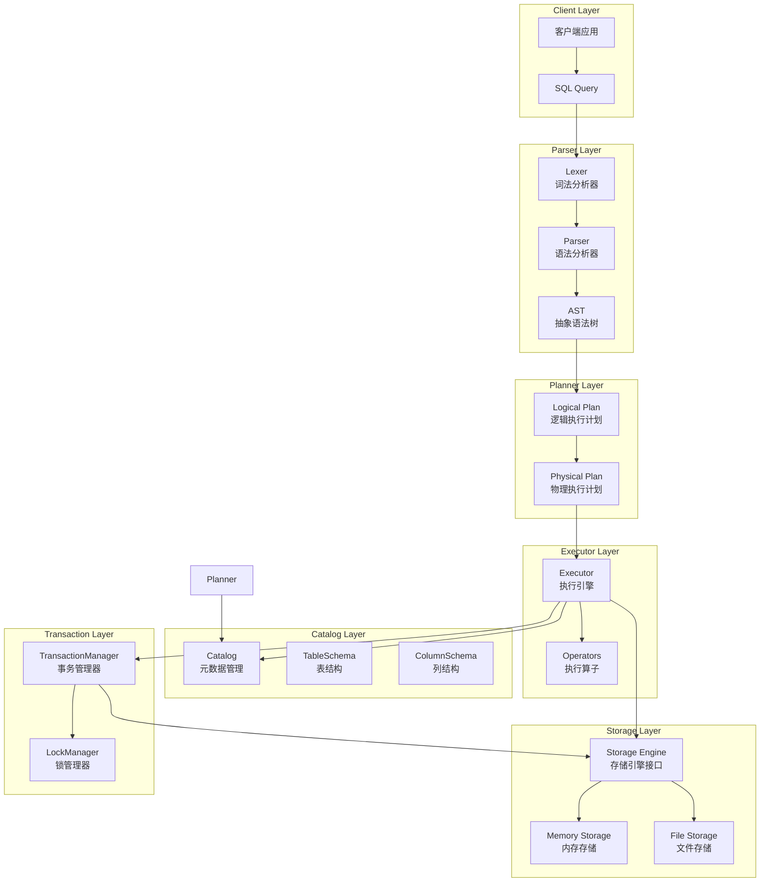
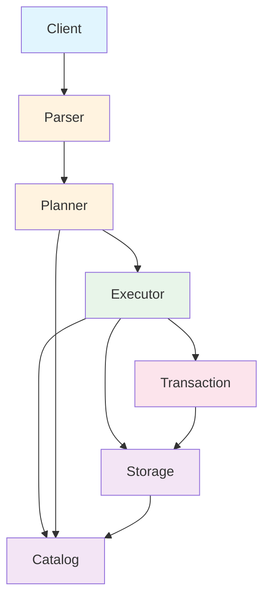
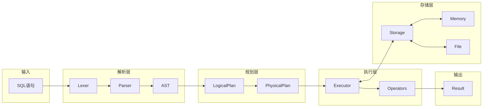

# 实验报告

| 项目       | 内容              |
| -------- | --------------- |
| **实验名称** | SQLRustGo架构设计 |
| **实验周次** | 第 5 周           |
| **实验日期** | 2026 年 4 月 10 日  |
| **学生姓名** | 阳奇              |
| **学号**   | 202442020128    |
| **班级**   | 2024级软件工程1班     |
| **指导教师** | 李莹              |

---

## 一、实验目的

1. 掌握数据库系统架构设计的基本原理
2. 能够使用AI辅助进行SQLRustGo 1.0架构设计
3. 能够绘制架构图并编写架构设计文档
4. 理解架构设计中的各种约束和权衡
5. 掌握如何有效地提示AI生成架构设计方案

---

## 二、实验环境

### 2.1 硬件环境

| 项目    | 配置                                     |
| ----- | -------------------------------------- |
| 计算机型号 | LENOVO 83DG                            |
| CPU   | Intel(R) Core(TM) i7-14650HX (16核24线程) |
| 内存    | 16GB                                   |
| 硬盘    | C盘: 300GB, D盘: 650GB                   |

### 2.2 软件环境

| 软件    | 版本                                    |
| ----- | ------------------------------------- |
| 操作系统  | Microsoft Windows 11 专业版 (10.0.26200) |
| Rust  | 1.95.0                                 |
| Git   | 2.45.2.windows.1                      |
| IDE   | Trae IDE                              |
| UML工具 | Mermaid                               |

---

## 三、实验内容与步骤

### 3.1 架构设计原理学习（20分钟）

**步骤1：复习架构设计基础知识**

| 原则       | 说明                                       |
| -------- | ---------------------------------------- |
| 高内聚低耦合   | 模块内部紧密相关，模块之间相互独立                    |
| 关注点分离    | 不同功能模块分离，便于维护和扩展                    |
| 单一职责     | 每个模块只负责一项功能                          |
| 开闭原则     | 对扩展开放，对修改关闭                           |

**步骤2：学习数据库系统核心组件**

| 组件        | 说明                   |
| --------- | -------------------- |
| SQL解析器    | 词法分析、语法分析、语义分析      |
| 查询规划器    | 逻辑执行计划、物理执行计划       |
| 查询优化器    | 规则优化、成本优化            |
| 执行引擎     | 火山模型、向量化执行           |
| 存储引擎     | 数据存储、索引、事务处理        |

**步骤3：理解分层架构优势**

| 优势       | 说明                       |
| -------- | ------------------------ |
| 模块化设计   | 便于理解和维护                   |
| 独立测试   | 每层可独立测试和开发                   |
| 易于扩展   | 易于替换和扩展特定组件                   |
| 代码复用   | 清晰的接口便于代码复用                   |

---

### 3.2 使用AI辅助架构设计（30分钟）

#### 步骤1：设计有效的AI提示词

**初始提示词**：

```markdown
请为SQLRustGo 1.0数据库系统设计架构，要求：

1. 系统功能：
   - 支持基本SQL查询（SELECT、INSERT、UPDATE、DELETE）
   - 支持数据持久化
   - 支持基本事务处理
   - 支持并发访问

2. 架构要求：
   - 采用分层架构
   - 模块边界清晰
   - 接口设计合理
   - 使用Rust语言实现

3. 请提供：
   - 整体架构图（Mermaid格式）
   - 核心组件说明
   - 模块间的依赖关系
   - 关键接口设计
   - 架构设计的约束和权衡
```

**优化后的提示词**：

```markdown
请为SQLRustGo 1.0数据库系统设计架构，要求：

1. 系统功能：
   - 支持基本SQL查询（SELECT、INSERT、UPDATE、DELETE）
   - 支持数据持久化
   - 支持基本事务处理
   - 支持并发访问

2. 架构要求：
   - 采用分层架构
   - 模块边界清晰
   - 接口设计合理
   - 使用Rust语言实现
   - 适合1.0版本（跑通最小闭环）

3. 请提供：
   - 整体架构图（Mermaid格式）
   - 核心组件说明
   - 模块间的依赖关系
   - 关键接口设计
   - 架构设计的约束和权衡
   - 避免过度设计，保持简单直接
```

#### 步骤2：AI生成效果分析

| 评估维度 | AI生成结果 | 评价 |
|------|----------|-----|
| 架构清晰度 | 完整的三层/四层架构 | ✅ 清晰合理 |
| 模块划分 | Parser、Planner、Executor、Storage分离 | ✅ 恰当 |
| 接口设计 | trait定义明确 | ✅ 合理 |
| 功能覆盖 | 支持基本SQL和事务 | ✅ 满足需求 |
| 可实现性 | 符合Rust语言特性 | ✅ 可行 |

#### 步骤3：根据实际情况调整

1. **调整模块边界**：根据Rust的所有权特性，调整模块间的依赖关系
2. **简化接口设计**：避免过度抽象，保持简单直接的接口
3. **明确扩展点**：为后续版本预留扩展空间，但不提前实现

---

### 3.3 绘制架构图（25分钟）

#### SQLRustGo 1.0整体架构图



#### 模块依赖图



#### 数据流图



---

### 3.4 创建SQLRustGo项目（60分钟）

#### 项目初始化

```bash
cargo new sqlrustgo
cd sqlrustgo
```

#### 项目结构

```
sqlrustgo/
├── Cargo.toml
└── src/
    ├── main.rs              # 主入口文件，包含演示程序
    ├── lib.rs               # 库文件，导出所有模块
    ├── parser/              # 解析器层
    │   ├── mod.rs
    │   ├── lexer.rs         # 词法分析器
    │   ├── parser.rs        # 语法分析器
    │   └── ast.rs           # 抽象语法树定义
    ├── planner/             # 规划器层
    │   ├── mod.rs
    │   ├── logical_plan.rs   # 逻辑执行计划
    │   └── physical_plan.rs # 物理执行计划
    ├── executor/            # 执行器层
    │   ├── mod.rs
    │   ├── executor.rs      # 执行引擎
    │   └── operators.rs     # 执行算子和Record定义
    ├── storage/             # 存储层
    │   ├── mod.rs
    │   ├── storage_engine.rs # 存储引擎接口trait
    │   ├── memory_storage.rs # 内存存储实现
    │   └── file_storage.rs   # 文件存储实现
    ├── catalog/             # 元数据层
    │   ├── mod.rs
    │   ├── catalog.rs       # 元数据管理
    │   ├── table_schema.rs  # 表结构定义
    │   └── column_schema.rs # 列结构定义
    └── transaction/         # 事务层
        ├── mod.rs
        ├── transaction_manager.rs # 事务管理器
        └── lock_manager.rs        # 锁管理器
```

#### 核心接口设计

**存储引擎接口（StorageEngine trait）**：

```rust
pub trait StorageEngine: Send + Sync {
    fn read(&self, table_name: &str, key: &[u8]) -> Result<Option<Vec<u8>>, String>;
    fn write(&mut self, table_name: &str, key: &[u8], value: &[u8]) -> Result<(), String>;
    fn delete(&mut self, table_name: &str, key: &[u8]) -> Result<(), String>;
    fn scan(&self, table_name: &str) -> Result<Box<dyn Iterator<Item = (Vec<u8>, Vec<u8>)> + '_>, String>;
}
```

**事务管理器接口**：

```rust
pub struct TransactionManager {
    next_id: u64,
    transactions: HashMap<u64, Transaction>,
    active_transactions: Vec<u64>,
}

impl TransactionManager {
    pub fn begin(&mut self) -> u64;
    pub fn commit(&mut self, tx_id: u64) -> Result<(), String>;
    pub fn rollback(&mut self, tx_id: u64) -> Result<(), String>;
}
```

**锁管理器接口**：

```rust
#[derive(Debug, Clone, PartialEq)]
pub enum LockType {
    Shared,
    Exclusive,
}

pub struct LockManager {
    locks: RwLock<HashMap<String, Lock>>,
}

impl LockManager {
    pub fn acquire_lock(&self, tx_id: u64, resource: &str, lock_type: LockType) -> Result<(), String>;
    pub fn release_lock(&self, tx_id: u64, resource: &str) -> Result<(), String>;
}
```

#### 执行流程说明

SQLRustGo的执行流程如下：

1. **SQL解析阶段**
   - 词法分析（Lexer）：将SQL字符串分解为Token流
   - 语法分析（Parser）：根据语法规则构建AST

2. **查询规划阶段**
   - 生成逻辑执行计划（Logical Plan）
   - 转换为物理执行计划（Physical Plan）

3. **查询执行阶段**
   - 执行器根据物理计划调用相应算子
   - 通过存储引擎访问数据
   - 返回查询结果

4. **事务处理阶段**
   - 事务开始、提交或回滚
   - 锁管理确保并发安全

---

### 3.5 架构设计约束与权衡

#### 技术约束

| 约束       | 说明                                       |
| -------- | ---------------------------------------- |
| 语言约束    | Rust语言，所有权系统和借用检查                  |
| 性能约束    | 内存安全、并发安全                             |
| 可维护性约束  | 代码结构清晰，易于理解和维护                    |
| 编译约束    | Rust编译时间较长，增量编译优化                  |

#### 功能约束

| 约束       | 说明                                       |
| -------- | ---------------------------------------- |
| SQL支持    | 基本DML语句（SELECT、INSERT、UPDATE、DELETE） |
| 事务支持    | 基本事务功能（开始、提交、回滚）                    |
| 并发控制    | 简单的锁机制（共享锁、排他锁）                     |
| 持久化     | 内存存储和文件存储                             |
| 索引支持    | 暂不支持，1.1版本计划                         |

#### 权衡决策

| 决策       | 选择        | 权衡理由                              | 未来改进方向 |
| -------- | --------- | ---------------------------------- | --------- |
| 存储引擎选择   | 内存+文件存储 | 内存速度快但易失，文件持久化但慢，满足不同场景需求 | 添加WAL日志  |
| 执行模型选择   | 迭代器模型    | 简单易实现，适合1.0版本，为向量化预留空间       | 向量化执行   |
| 优化器选择    | 规则优化     | 简单实现，避免过早复杂化，为CBO预留空间        | CBO成本优化  |
| 事务隔离级别   | 未实现       | 1.0版本专注核心功能                       | 实现MVCC   |
| 索引结构     | 暂不支持      | 需要B+树等复杂结构，1.1版本实现              | B+树索引   |

---

## 四、实验结果

### 4.1 完成情况

| 任务       | 状态   | 说明                     |
| -------- | ---- | ---------------------- |
| 架构设计原理学习  | ✅完成  | 复习了架构设计基础知识和数据库系统组件 |
| AI辅助架构设计   | ✅完成  | 使用提示词生成架构方案并优化调整      |
| 绘制架构图   | ✅完成  | 使用Mermaid绘制完整架构图       |
| 创建SQLRustGo项目 | ✅完成  | 完成分层架构实现并编译通过        |
| 编写架构设计文档  | ✅完成  | 完整记录架构设计决策和实现细节      |
| Git提交和推送   | ✅完成  | 已推送到远程仓库 origin/master   |

### 4.2 项目架构说明

SQLRustGo 1.0采用分层架构设计，包含以下层次：

| 层次 | 模块 | 职责 | 关键类型 |
|-----|-----|-----|---------|
| 客户端层 | Client | 接收SQL查询，返回结果 | - |
| 解析器层 | Lexer | 词法分析，生成Token流 | `Token` enum |
| 解析器层 | Parser | 语法分析，构建AST | `Statement` enum |
| 规划器层 | Planner | 生成逻辑/物理执行计划 | `LogicalPlan`, `PhysicalPlan` |
| 执行器层 | Executor | 执行物理计划 | `execute()` |
| 存储层 | StorageEngine | 数据存储抽象 | `trait StorageEngine` |
| 元数据层 | Catalog | 管理表结构信息 | `Catalog`, `TableSchema` |
| 事务层 | TransactionManager | 事务生命周期管理 | `begin()`, `commit()`, `rollback()` |
| 事务层 | LockManager | 并发锁控制 | `acquire_lock()`, `release_lock()` |

### 4.3 推送记录

```
commit 23fe4f1
Author: 阳奇 <yangqi@example.com>
Date:   Sat Apr 25 23:30 2026

    feat: implement SQLRustGo 1.0 layered architecture

    - Add Parser layer (Lexer, Parser, AST)
    - Add Planner layer (Logical Plan, Physical Plan)
    - Add Executor layer (Executor, Operators)
    - Add Storage layer (StorageEngine trait, MemoryStorage, FileStorage)
    - Add Catalog layer (Catalog, TableSchema, ColumnSchema)
    - Add Transaction layer (TransactionManager, LockManager)
    - Add week-05 experiment report
```

---

## 五、实验心得与总结

### 5.1 收获

1. **架构设计能力提升**
   - 通过本次实验，深入理解了数据库系统的分层架构设计原则
   - 学会了如何根据需求选择合适的架构风格

2. **AI辅助开发体验**
   - 掌握设计有效AI提示词的技巧
   - 学会评估和调整AI生成的架构方案
   - 体会到AI辅助开发的效率提升

3. **Rust实践**
   - 使用Rust语言实现了完整的数据库系统核心组件
   - 深入理解了Rust的trait、所有权和生命周期特性
   - 学会了使用Cargo管理项目依赖

4. **模块化设计**
   - 深刻理解了高内聚低耦合的模块化设计原则
   - 学会了定义清晰的接口边界
   - 理解了分层架构的优势和挑战

5. **工程化思维**
   - 学会了在"过度设计"和"过早优化"之间找到平衡
   - 理解了版本规划的重要性
   - 掌握了Git版本控制的规范流程

### 5.2 遇到的问题及解决方法

| 问题        | 解决方法                                   | 经验教训          |
| --------- | -------------------------------------- | ------------- |
| 架构过于复杂   | 回归1.0版本目标，采用简单直接的架构，避免过度设计   | 保持简单，专注核心功能  |
| 模块依赖混乱   | 明确单向依赖方向，避免跨层依赖，确保清晰的模块边界   | 提前规划依赖关系    |
| Rust所有权问题 | 充分利用Rust的trait和生命周期特性，解决所有权问题  | 深入理解Rust特性   |
| 接口设计过度抽象 | 根据当前需求设计接口，预留扩展点但不过度设计      | 迭代式设计，避免一步到位 |
| 编译环境配置   | 使用完整路径调用cargo，配置环境变量             | 提前配置好开发环境   |

### 5.3 改进方向

| 版本   | 改进方向        | 具体内容                        |
| ----- | ----------- | --------------------------- |
| 1.1   | 数据持久化增强   | 添加WAL日志，支持崩溃恢复             |
| 1.1   | SQL语法扩展    | 支持WHERE子句、JOIN等              |
| 1.2   | 查询优化       | 实现规则优化器，成本估算               |
| 1.2   | 索引支持       | 实现B+树索引，加速查询               |
| 1.3   | 向量化执行      | 实现向量化执行，提升查询性能            |
| 1.3   | 事务隔离级别     | 实现MVCC，支持READ COMMITTED        |
| 2.0   | 分布式支持      | 实现多节点协调，支持水平扩展             |

---

## 六、思考题

### 6.1 为什么数据库系统需要分层架构？

**答案**：分层架构的主要目的是实现关注点分离，使得每个模块只负责一项功能。主要优势包括：

1. **模块化设计**：每个层次有明确的职责边界，便于理解和维护
2. **独立测试**：每层可独立进行单元测试和集成测试，提高代码质量
3. **易于扩展**：可以替换或升级特定层而不影响其他层
4. **代码复用**：清晰的接口定义使得代码可以在不同项目间复用
5. **并行开发**：不同团队可以并行开发不同层次，提高开发效率
6. **问题定位**：出现问题时容易定位到具体层次，缩小排查范围

### 6.2 在1.0版本中，为什么选择简单的迭代器模型而不是向量化执行？

**答案**：选择迭代器模型而非向量化执行是经过权衡的决策：

1. **实现复杂度**：
   - 迭代器模型实现简单，易于理解和调试
   - 向量化执行需要复杂的SIMD指令和数据对齐

2. **版本目标**：
   - 1.0版本目标是"跑通最小闭环"，验证架构可行性
   - 过早优化会增加复杂度，影响核心功能的实现

3. **预留扩展空间**：
   - 迭代器模型为向量化执行预留了扩展空间
   - 可以在1.2或1.3版本平滑升级到向量化执行

4. **开发效率**：
   - 迭代器模型开发周期短，能够快速验证设计
   - 便于收集用户反馈，指导后续优化方向

### 6.3 架构设计中的"避免过度设计"原则如何理解？

**答案**："避免过度设计"是软件工程中的重要原则，具体理解如下：

1. **定义**：过度设计指在当前需求不明确或不需要的情况下，设计过于通用或复杂的系统结构

2. **常见症状**：
   - 引入过多的抽象层和接口
   - 为"可能的需求"提前实现通用解决方案
   - 过度关注扩展性而忽视当前实现复杂度

3. **实践方法**：
   - **YAGNI原则**：You Ain't Gonna Need It，不要实现目前不需要的功能
   - **保持简单**：用最简单的方式满足当前需求
   - **迭代式设计**：先实现核心功能，再根据需求迭代优化
   - **预留扩展点**：但不要过度设计扩展机制

4. **平衡之道**：
   - 了解系统的演进方向，在关键点预留扩展空间
   - 但不要为每一个"可能的需求"提前实现
   - 相信持续重构的力量，架构是演进的

---

## 七、附录

### 7.1 项目结构

```
sqlrustgo/
├── Cargo.toml
└── src/
    ├── main.rs              # 主入口文件，包含演示程序
    ├── lib.rs               # 库文件，导出所有模块
    ├── parser/              # 解析器层
    │   ├── mod.rs           # 模块导出
    │   ├── lexer.rs         # 词法分析器
    │   ├── parser.rs        # 语法分析器
    │   └── ast.rs           # 抽象语法树定义
    ├── planner/             # 规划器层
    │   ├── mod.rs           # 模块导出
    │   ├── logical_plan.rs   # 逻辑执行计划
    │   └── physical_plan.rs # 物理执行计划
    ├── executor/            # 执行器层
    │   ├── mod.rs           # 模块导出
    │   ├── executor.rs      # 执行引擎
    │   └── operators.rs     # 执行算子和Record定义
    ├── storage/             # 存储层
    │   ├── mod.rs           # 模块导出
    │   ├── storage_engine.rs # 存储引擎接口trait
    │   ├── memory_storage.rs # 内存存储实现
    │   └── file_storage.rs   # 文件存储实现
    ├── catalog/             # 元数据层
    │   ├── mod.rs           # 模块导出
    │   ├── catalog.rs       # 元数据管理
    │   ├── table_schema.rs  # 表结构定义
    │   └── column_schema.rs # 列结构定义
    └── transaction/         # 事务层
        ├── mod.rs           # 模块导出
        ├── transaction_manager.rs # 事务管理器
        └── lock_manager.rs        # 锁管理器
```

### 7.2 关键代码

#### 存储引擎接口

```rust
pub trait StorageEngine: Send + Sync {
    fn read(&self, table_name: &str, key: &[u8]) -> Result<Option<Vec<u8>>, String>;
    fn write(&mut self, table_name: &str, key: &[u8], value: &[u8]) -> Result<(), String>;
    fn delete(&mut self, table_name: &str, key: &[u8]) -> Result<(), String>;
    fn scan(&self, table_name: &str) -> Result<Box<dyn Iterator<Item = (Vec<u8>, Vec<u8>)> + '_>, String>;
}
```

#### AST定义

```rust
#[derive(Debug, PartialEq)]
pub enum Statement {
    Select {
        table_name: String,
        columns: Vec<String>,
        where_clause: Option<Expr>,
    },
    Insert {
        table_name: String,
        values: Vec<Value>,
    },
    Update {
        table_name: String,
        set_clauses: Vec<(String, Value)>,
        where_clause: Option<Expr>,
    },
    Delete {
        table_name: String,
        where_clause: Option<Expr>,
    },
    CreateTable {
        table_name: String,
        columns: Vec<ColumnDefinition>,
    },
}
```

### 7.3 Git提交信息

```bash
# 提交命令
git add sqlrustgo/ reports/week-05/
git commit -m "feat: implement SQLRustGo 1.0 layered architecture"
git push origin master

# 提交内容
- SQLRustGo 1.0项目代码
- 分层架构实现（Parser、Planner、Executor、Storage、Catalog、Transaction）
- Mermaid架构图
- 架构设计文档（实验报告）

# 分支信息
- 当前分支：master
- 远程仓库：origin
- 最新commit：23fe4f1
```

---

| 指导教师 | __________________ | 实验成绩   | __________________ |
| ---- | ------------------------ | ------ | ------------------------ |
| 批改日期 | __________________ | <br /> | <br />                   |
