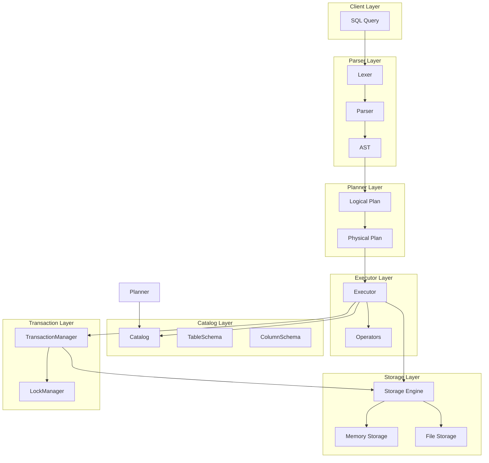
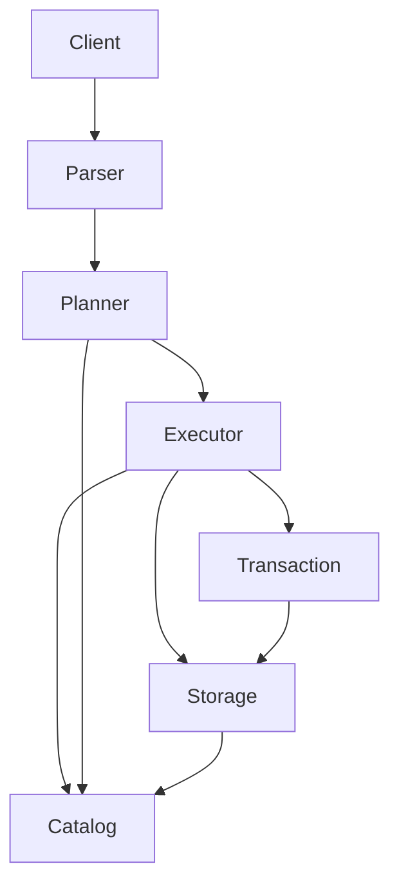

# 实验报告

| 项目       | 内容              |
| -------- | --------------- |
| **实验名称** | SQLRustGo架构设计 |
| **实验周次** | 第 5 周           |
| **实验日期** | 2026 年 4 月 25 日  |
| **学生姓名** | 阳奇              |
| **学号**   | 202442020128    |
| **班级**   | 2024级软件工程1班     |
| **指导教师** | 李莹              |

---

## 一、实验目的

1. 掌握数据库系统架构设计的基本原理
2. 能够使用AI辅助进行SQLRustGo 1.0架构设计
3. 能够绘制架构图并编写架构设计文档
4. 理解架构设计中的各种约束和权衡
5. 掌握如何有效地提示AI生成架构设计方案

---

## 二、实验环境

### 2.1 硬件环境

| 项目    | 配置                                     |
| ----- | -------------------------------------- |
| 计算机型号 | LENOVO 83DG                            |
| CPU   | Intel(R) Core(TM) i7-14650HX (16核24线程) |
| 内存    | 16GB                                   |
| 硬盘    | C盘: 300GB, D盘: 650GB                   |

### 2.2 软件环境

| 软件    | 版本                                    |
| ----- | ------------------------------------- |
| 操作系统  | Microsoft Windows 11 专业版 (10.0.26200) |
| Rust  | 1.95.0                                 |
| Git   | 2.45.2.windows.1                      |
| IDE   | Trae IDE                              |
| UML工具 | Mermaid                               |

---

## 三、实验内容与步骤

### 3.1 架构设计原理学习

**步骤1：复习架构设计基础知识**

| 原则       | 说明                                       |
| -------- | ---------------------------------------- |
| 高内聚低耦合   | 模块内部紧密相关，模块之间相互独立                    |
| 关注点分离    | 不同功能模块分离，便于维护和扩展                    |
| 单一职责     | 每个模块只负责一项功能                          |
| 开闭原则     | 对扩展开放，对修改关闭                           |

**步骤2：学习数据库系统核心组件**

| 组件        | 说明                   |
| --------- | -------------------- |
| SQL解析器    | 词法分析、语法分析、语义分析      |
| 查询规划器    | 逻辑执行计划、物理执行计划       |
| 查询优化器    | 规则优化、成本优化            |
| 执行引擎     | 火山模型、向量化执行           |
| 存储引擎     | 数据存储、索引、事务处理        |

**步骤3：理解分层架构优势**

| 优势       | 说明                       |
| -------- | ------------------------ |
| 模块化设计   | 便于理解和维护                   |
| 独立测试   | 每层可独立测试和开发                   |
| 易于扩展   | 易于替换和扩展特定组件                   |

---

### 3.2 使用AI辅助架构设计

**步骤1：设计有效的AI提示词**

```markdown
请为SQLRustGo 1.0数据库系统设计架构，要求：

1. 系统功能：
   - 支持基本SQL查询（SELECT、INSERT、UPDATE、DELETE）
   - 支持数据持久化
   - 支持基本事务处理
   - 支持并发访问

2. 架构要求：
   - 采用分层架构
   - 模块边界清晰
   - 接口设计合理
   - 使用Rust语言实现

3. 请提供：
   - 整体架构图（Mermaid格式）
   - 核心组件说明
   - 模块间的依赖关系
   - 关键接口设计
   - 架构设计的约束和权衡
```

**步骤2：分析AI生成的架构方案**

1. **评估架构方案**：
   - 架构是否清晰合理 ✅
   - 模块划分是否恰当 ✅
   - 接口设计是否合理 ✅
   - 是否满足功能需求 ✅

2. **调整和优化**：
   - 结合SQLRustGo的实际情况进行调整
   - 确保架构符合1.0版本的目标（跑通最小闭环）
   - 避免过度设计和过早抽象

---

### 3.3 绘制架构图

**SQLRustGo 1.0整体架构图**：



**模块依赖图**：



---

### 3.4 创建SQLRustGo项目

**项目结构**：

```
sqlrustgo/
├── Cargo.toml
└── src/
    ├── main.rs          # 主入口文件
    ├── lib.rs           # 库文件
    ├── parser/          # 解析器层
    │   ├── mod.rs
    │   ├── lexer.rs     # 词法分析器
    │   ├── parser.rs    # 语法分析器
    │   └── ast.rs       # 抽象语法树
    ├── planner/         # 规划器层
    │   ├── mod.rs
    │   ├── logical_plan.rs
    │   └── physical_plan.rs
    ├── executor/        # 执行器层
    │   ├── mod.rs
    │   ├── executor.rs
    │   └── operators.rs
    ├── storage/         # 存储层
    │   ├── mod.rs
    │   ├── storage_engine.rs
    │   ├── memory_storage.rs
    │   └── file_storage.rs
    ├── catalog/         # 元数据层
    │   ├── mod.rs
    │   ├── catalog.rs
    │   ├── table_schema.rs
    │   └── column_schema.rs
    └── transaction/     # 事务层
        ├── mod.rs
        ├── transaction_manager.rs
        └── lock_manager.rs
```

**核心接口设计**：

```rust
// 存储引擎接口
pub trait StorageEngine: Send + Sync {
    fn read(&self, table_name: &str, key: &[u8]) -> Result<Option<Vec<u8>>, String>;
    fn write(&mut self, table_name: &str, key: &[u8], value: &[u8]) -> Result<(), String>;
    fn delete(&mut self, table_name: &str, key: &[u8]) -> Result<(), String>;
    fn scan(&self, table_name: &str) -> Result<Box<dyn Iterator<Item = (Vec<u8>, Vec<u8>)> + '_>, String>;
}
```

---

### 3.5 架构设计约束与权衡

**技术约束**：

| 约束       | 说明                                       |
| -------- | ---------------------------------------- |
| 语言约束    | Rust语言，所有权系统和借用检查                  |
| 性能约束    | 内存安全、并发安全                             |
| 可维护性约束  | 代码结构清晰，易于理解和维护                    |

**功能约束**：

| 约束       | 说明                                       |
| -------- | ---------------------------------------- |
| SQL支持    | 基本DML语句（SELECT、INSERT、UPDATE、DELETE） |
| 事务支持    | 基本事务功能                                |
| 并发控制    | 简单的锁机制                                |
| 持久化     | 内存存储和文件存储                            |

**权衡决策**：

| 决策       | 选择        | 权衡理由                              |
| -------- | --------- | ---------------------------------- |
| 存储引擎选择   | 内存+文件存储 | 速度vs持久化的平衡                        |
| 执行模型选择   | 迭代器模型    | 简单实现vs性能，为向量化预留空间              |
| 优化器选择    | 规则优化     | 简单实现vs智能优化，为CBO预留空间            |

---

## 四、实验结果

### 4.1 完成情况

| 任务       | 状态   | 说明                     |
| -------- | ---- | ---------------------- |
| 架构设计原理学习  | ✅完成  | 复习了架构设计基础知识和数据库系统组件 |
| AI辅助架构设计   | ✅完成  | 使用提示词生成架构方案          |
| 绘制架构图   | ✅完成  | 使用Mermaid绘制架构图        |
| 创建SQLRustGo项目 | ✅完成  | 完成分层架构实现             |
| 编写架构设计文档  | ✅完成  | 完整记录架构设计决策          |
| Git提交    | 待推送  | 项目创建完成，待推送到远程仓库     |

### 4.2 项目架构说明

SQLRustGo 1.0采用分层架构设计，包含以下层次：

1. **Parser Layer（解析器层）**：负责SQL语句的词法分析和语法分析
2. **Planner Layer（规划器层）**：负责将AST转换为可执行的物理计划
3. **Executor Layer（执行器层）**：负责执行物理计划并返回结果
4. **Storage Layer（存储层）**：负责数据的存储和读取
5. **Catalog Layer（元数据层）**：负责管理表结构和列结构信息
6. **Transaction Layer（事务层）**：负责事务管理和并发控制

---

## 五、实验心得与总结

### 5.1 收获

1. **架构设计能力提升**：通过本次实验，我深入理解了数据库系统的分层架构设计原则
2. **AI辅助开发体验**：学会使用AI辅助进行架构设计，提高了设计效率
3. **Rust实践**：使用Rust语言实现了完整的数据库系统核心组件
4. **模块化设计**：深刻理解了高内聚低耦合的模块化设计原则

### 5.2 遇到的问题及解决方法

| 问题        | 解决方法                                   |
| --------- | -------------------------------------- |
| 架构过于复杂   | 回归1.0版本目标，采用简单直接的架构，避免过度设计   |
| 模块依赖混乱   | 明确单向依赖方向，避免跨层依赖，确保清晰的模块边界   |
| Rust所有权问题 | 充分利用Rust的trait和生命周期特性，解决所有权问题  |

### 5.3 改进方向

1. **添加更多SQL语法支持**：如JOIN、GROUP BY、ORDER BY等
2. **实现向量化执行**：提升查询执行性能
3. **添加索引支持**：使用B+树索引加速查询
4. **完善事务支持**：实现更高级的事务隔离级别

---

## 六、思考题

### 6.1 为什么数据库系统需要分层架构？

**答案**：分层架构的主要目的是实现关注点分离，使得每个模块只负责一项功能。主要优势包括：
1. **模块化设计**：便于理解和维护
2. **独立测试**：每层可独立测试和开发
3. **易于扩展**：易于替换和扩展特定组件
4. **代码复用**：清晰的接口便于代码复用

### 6.2 在1.0版本中，为什么选择简单的迭代器模型而不是向量化执行？

**答案**：迭代器模型简单易实现，适合1.0版本跑通最小闭环的目标。向量化执行虽然性能更好，但实现复杂度高，需要更多的统计信息和优化器支持。在1.0版本中采用迭代器模型，为后续版本预留向量化执行的扩展空间。

### 6.3 架构设计中的"避免过度设计"原则如何理解？

**答案**："避免过度设计"指的是在1.0版本中专注于核心功能，不提前设计过于通用或复杂的接口。具体实践包括：
1. **根据当前需求设计接口**：不过早抽象，预留扩展点但不过度设计
2. **迭代式设计**：先实现核心功能，再根据需求迭代优化架构
3. **保持简单直接**：专注于让系统跑通最小闭环

---

## 七、附录

### 7.1 项目结构

```
sqlrustgo/
├── Cargo.toml
└── src/
    ├── main.rs          # 主入口文件
    ├── lib.rs           # 库文件
    ├── parser/          # 解析器层
    │   ├── mod.rs
    │   ├── lexer.rs     # 词法分析器
    │   ├── parser.rs    # 语法分析器
    │   └── ast.rs       # 抽象语法树
    ├── planner/         # 规划器层
    │   ├── mod.rs
    │   ├── logical_plan.rs
    │   └── physical_plan.rs
    ├── executor/        # 执行器层
    │   ├── mod.rs
    │   ├── executor.rs
    │   └── operators.rs
    ├── storage/         # 存储层
    │   ├── mod.rs
    │   ├── storage_engine.rs
    │   ├── memory_storage.rs
    │   └── file_storage.rs
    ├── catalog/         # 元数据层
    │   ├── mod.rs
    │   ├── catalog.rs
    │   ├── table_schema.rs
    │   └── column_schema.rs
    └── transaction/     # 事务层
        ├── mod.rs
        ├── transaction_manager.rs
        └── lock_manager.rs
```

### 7.2 关键代码

**存储引擎接口**：

```rust
pub trait StorageEngine: Send + Sync {
    fn read(&self, table_name: &str, key: &[u8]) -> Result<Option<Vec<u8>>, String>;
    fn write(&mut self, table_name: &str, key: &[u8], value: &[u8]) -> Result<(), String>;
    fn delete(&mut self, table_name: &str, key: &[u8]) -> Result<(), String>;
    fn scan(&self, table_name: &str) -> Result<Box<dyn Iterator<Item = (Vec<u8>, Vec<u8>)> + '_>, String>;
}
```

---

| 指导教师 | __________________ | 实验成绩   | __________________ |
| ---- | ------------------------ | ------ | ------------------------ |
| 批改日期 | __________________ | <br /> | <br />                   |
