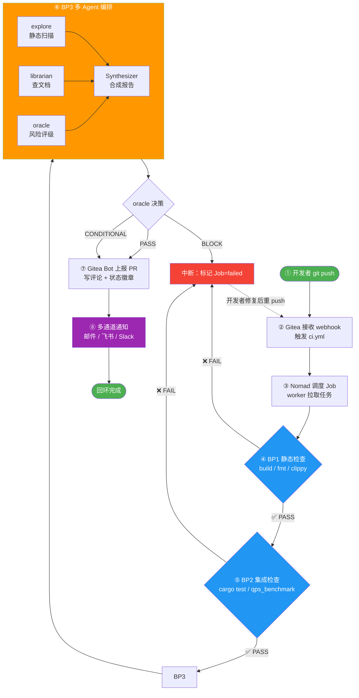
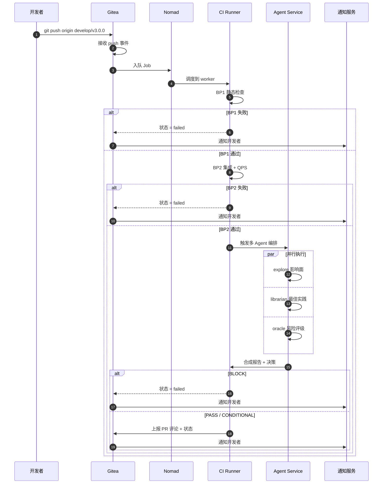

# Gate 联动流程图（CI/CD 自动化执行引擎）

> 实验周次：第 11 周
> 实验类型：CI/CD与Agent编排

---

## 一、ASCII 全景图（8 步完整链路）

```
┌─────────────────────────────────────────────────────────────────────────────┐
│                                                                             │
│                  Gate 联动流程（push → 反馈）                                │
│                                                                             │
├─────────────────────────────────────────────────────────────────────────────┤
│                                                                             │
│  ① 开发者 push 代码                                                          │
│     git push origin develop/v3.0.0                                          │
│     ┌──────────────────┐                                                   │
│     │ developer/本地仓库 │                                                   │
│     └────────┬─────────┘                                                   │
│              │ (1) push event                                               │
│              ▼                                                              │
│  ② Gitea 接收 webhook                                                       │
│     ┌──────────────────┐                                                   │
│     │  Gitea Server     │                                                   │
│     │  POST /webhook    │                                                   │
│     │  → 触发 ci.yml    │                                                   │
│     └────────┬─────────┘                                                   │
│              │ (2) enqueue Job                                              │
│              ▼                                                              │
│  ③ Nomad 调度 Job                                                           │
│     ┌──────────────────┐                                                   │
│     │  Nomad Cluster   │                                                    │
│     │  worker 节点拉取   │                                                    │
│     │  ubuntu-latest    │                                                   │
│     └────────┬─────────┘                                                   │
│              │ (3) run jobs                                                 │
│              ▼                                                              │
│  ④ BP1 静态检查 (bp1-static)                                                │
│     ┌──────────────────────────────────────┐                               │
│     │  cargo build --all-features          │                               │
│     │  cargo fmt  --check --all            │                               │
│     │  cargo clippy --all-features -D warn │                               │
│     └────────┬─────────────────────────────┘                               │
│              │                                                              │
│       ┌──────┴──────┐                                                       │
│       ▼             ▼                                                       │
│    ✅ PASS       ❌ FAIL ──────► (A) 中断回环                                │
│       │                                                                  │
│       │ (4) needs 满足                                                     │
│       ▼                                                                  │
│  ⑤ BP2 集成 / 行为检查 (bp2-integration)                                   │
│     ┌──────────────────────────────────────┐                               │
│     │  cargo test --all-features            │                               │
│     │  cargo test --test qps_benchmark_test│                               │
│     └────────┬─────────────────────────────┘                               │
│              │                                                              │
│       ┌──────┴──────┐                                                       │
│       ▼             ▼                                                       │
│    ✅ PASS       ❌ FAIL ──────► (A) 中断回环                                │
│       │                                                                  │
│       │ (5) 提交质量达标                                                     │
│       ▼                                                                  │
│  ⑥ BP3 风险检查（多 Agent 编排）                                          │
│     ┌──────────────┬──────────────┬──────────────┐                          │
│     │   explore    │  librarian   │    oracle    │                          │
│     │  静态代码扫描  │  查外部文档    │   风险评级    │                          │
│     │  影响面报告    │  最佳实践清单  │  PASS/CONDI  │                          │
│     │              │              │  /BLOCK      │                          │
│     └──────┬───────┴──────┬───────┴──────┬───────┘                          │
│            │              │              │                                  │
│            └──────────────┼──────────────┘                                  │
│                           ▼                                                  │
│                  ┌──────────────────┐                                        │
│                  │  Synthesizer     │                                        │
│                  │  合成统一报告       │                                        │
│                  └────────┬─────────┘                                        │
│                           │                                                  │
│                ┌──────────┼──────────┐                                       │
│                ▼          ▼          ▼                                       │
│              PASS     CONDITION   BLOCK ──────► (A) 中断回环                  │
│                │                                                                  │
│                │ (6) 允许合并                                                      │
│                ▼                                                                  │
│  ⑦ 结果上报 PR 评论                                                              │
│     ┌──────────────────┐                                                   │
│     │  Gitea Bot        │                                                   │
│     │  写回 PR 评论       │                                                   │
│     │  + CI 状态徽章     │                                                   │
│     └────────┬─────────┘                                                   │
│              │ (7) commit status event                                      │
│              ▼                                                              │
│  ⑧ 开发者收到通知                                                            │
│     ┌──────────┬──────────┬──────────┐                                      │
│     │   邮件    │  飞书    │  Slack   │                                      │
│     │ @dev@..  │ Webhook  │ Webhook  │                                      │
│     └──────────┴──────────┴──────────┘                                      │
│                                                                             │
└─────────────────────────────────────────────────────────────────────────────┘


   (A) 中断回环（任一步失败都走这里）
   ┌─────────────────────────────────────────┐
   │  Nomad 标记 Job = failed                │
   │       │                                  │
   │       ▼                                  │
   │  Gitea 接收 status 事件                  │
   │       │                                  │
   │       ├─► PR 评论标记 ⛔ Blocked          │
   │       ├─► 邮件发件人 noreply@.gitea.io   │
   │       └─► 飞书/Slack 推送 @developer      │
   │                                          │
   │  开发者修复 → 重新 push → 回到 ②          │
   └─────────────────────────────────────────┘
```

---

## 二、Mermaid 流程图（GitHub/Gitea 自动渲染）



---

## 三、时序图（Sequence Diagram）



---

## 四、失败分支示意

```
任何一步 ❌ FAIL
   │
   ▼
┌──────────────────────┐
│ Nomad 标记 Job 状态   │
│ = failed              │
└──────────┬───────────┘
           │
           ▼
┌──────────────────────┐
│ Gitea 接收 status 事件 │
└──────────┬───────────┘
           │
   ┌───────┼───────┐
   ▼       ▼       ▼
PR 评论   邮件    飞书/Slack
标记 ⛔   发件人   推送
Blocked  noreply  @developer
         @gitea
```

---

## 五、与第10周 Gate 模拟的对照

| 第10周                              | 第11周                                              |
| --------------------------------- | ------------------------------------------------ |
| Gate = 本地脚本模拟（`echo "=== BP1 ==="`） | Gate = CI 工作流（`.gitea/workflows/ci.yml`）      |
| 一次跑通 BP1 + BP2                 | 每次 push / PR 自动跑                                |
| 手动汇总日志                          | Gitea 自动汇总到 PR 评论 + 通知                        |
| BP3 = 概念                         | BP3 = 多 Agent 编排（explore / librarian / oracle） |
| 反馈延迟：开发完才知                     | 反馈即时：每次提交即知                                    |

**关键认知**：CI/CD 不是替代 Gate，而是把 Gate **常态化、自动化**——以前是"开发完手动跑一次"，现在是"每次提交自动跑"。

---

## 六、节点说明

| 节点              | 角色                    | 关键动作                                          |
| --------------- | --------------------- | --------------------------------------------- |
| ① push          | 开发者 / 本地仓库           | `git push origin develop/v3.0.0`              |
| ② webhook       | Gitea Server          | 接收 push 事件，触发 Actions workflow             |
| ③ Nomad         | 集群调度器                | 把 Job 调度到空闲 worker                           |
| ④ BP1           | 静态检查 Job              | 编译 / 格式 / Clippy 三件套                         |
| ⑤ BP2           | 集成 / 行为 Job            | 单元测试 + QPS 性能                                 |
| ⑥ BP3           | 风险 / Agent 编排 Job      | explore + librarian + oracle 并行              |
| ⑦ PR Comment    | Gitea Bot             | 汇总 BP1/BP2/BP3 结果，写回 PR 评论                  |
| ⑧ 通知           | 邮件 / 飞书 / Slack       | 同步推送结果给开发者                                   |
| (A) 中断回环        | 任何失败都触发              | 标记 failed → 通知 → 开发者修复 → 重新 push → 回到 ②    |

---

## 七、对应本仓库的具体实现

| 链路节点 | 本仓库的落地文件 / 命令                                                                  |
| -------- | ---------------------------------------------------------------------------------- |
| ① push    | `git push origin develop/v3.0.0`（当前分支 `experiment/week-10-202442020128` 暂未推送） |
| ② webhook | Gitea 接收事件                                                                     |
| ③ Job    | `.gitea/workflows/ci.yml` 中的 `bp1-static` / `bp2-integration` 两个 job              |
| ④ BP1    | `cargo build --all-features` / `cargo fmt --check --all` / `cargo clippy ... -D warnings` |
| ⑤ BP2    | `cargo test --all-features` / `cargo test --test qps_benchmark_test -- --ignored --nocapture` |
| ⑥ BP3    | 设计中的多 Agent 编排（explore / librarian / oracle），后续可加 `bp3-agent-review` job      |
| ⑦ 上报   | Gitea Bot 自动写回 PR 评论                                                            |
| ⑧ 通知   | Gitea → Webhook → 邮件 / 飞书 / Slack                                              |

---

*最后更新: 2026-05-23*
