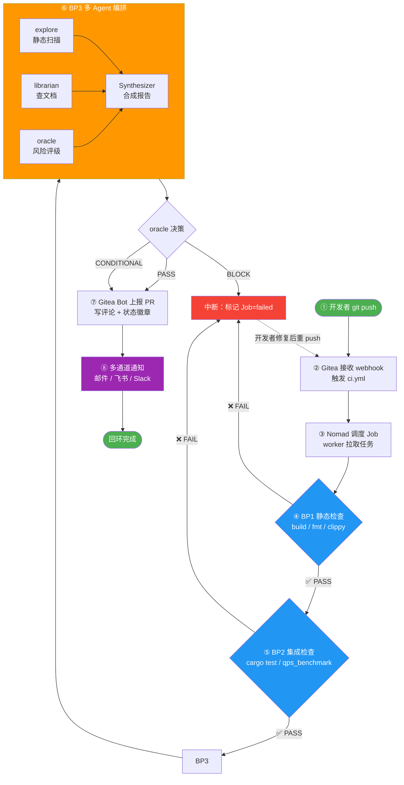
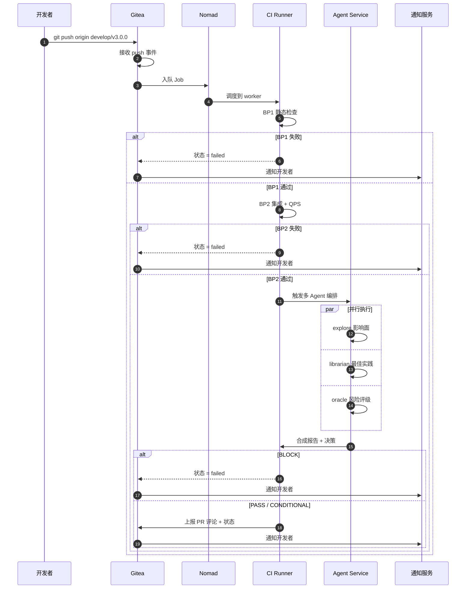

# 实验报告

| 项目       | 内容                               |
| -------- | -------------------------------- |
| **实验名称** | CI/CD与Agent编排 —— 自动化执行引擎与多Agent协作 |
| **实验周次** | 第 11 周                           |
| **实验日期** | 2026 年 5 月 23 日                 |
| **学生姓名** | 阳奇                               |
| **学号**   | 202442020128                     |
| **班级**   | 2024级软件工程1班                      |
| **指导教师** | 李莹                               |

***

## 一、实验目的

1. 理解 CI/CD 在 Harness 中的角色（"自动化执行引擎"）
2. 能够配置 Gitea Actions CI 工作流
3. 理解 Agent 编排在 CI/CD 中的应用（explore / librarian / oracle 并行分析）
4. 能够设计一个多 Agent 协作的 CI 流程
5. 掌握 Gate 联动机制，理解 push → webhook → Job → BP1/BP2/BP3 → 反馈的完整链路

***

## 二、实验环境

### 2.1 硬件环境

| 项目    | 配置                                     |
| ----- | -------------------------------------- |
| 计算机型号 | LENOVO 83DG                            |
| CPU   | Intel(R) Core(TM) i7-14650HX (16核24线程) |
| 内存    | 16GB                                   |
| 硬盘    | C盘: 300GB, D盘: 650GB                   |

### 2.2 软件环境

| 软件   | 版本                                    |
| ---- | ------------------------------------- |
| 操作系统 | Microsoft Windows 11 专业版 (10.0.26200) |
| Rust | 1.96.0                                |
| Git  | 2.45.2.windows.1                      |
| IDE  | Trae IDE                              |
| AI工具 | Claude Code, OpenCode                 |
| CI平台 | Gitea Actions（实验中配置）                  |

***

## 三、实验内容与步骤

### 3.1 阶段转变说明

**本周是"Harness治理实战"第2周！**

| 上周（第10周）          | 本周（第11周）              |
| ----------------- | --------------------- |
| Harness治理实战（第1周） | **CI/CD与Agent编排**    |
| 性能优化 + Gate检查     | **多Agent并行分析**       |
| QPS 基准 + 根因定位     | **CI配置 + 编排设计 + Gate** |

**本周的核心转变**：

- 从"自己跑测试"转向"让 CI 自动跑"
- 从"AI 单兵作战"转向"多 Agent 协同"
- 理解 CI/CD = 把 Gate 检查自动化，把流程工程化
- 探索 explore / librarian / oracle 三类 Agent 的分工与协作

***

### 3.2 步骤0：确认分支环境

#### 0.1 查看当前分支

```bash
git branch --show-current
```

**输出结果**：

```
experiment/week-10-202442020128
```

#### 0.2 查看仓库内是否已有 `.gitea` 目录

```bash
ls -la .gitea 2>&1 || echo "No .gitea directory found"
```

**输出结果**：

```
No .gitea directory found
```

#### 0.3 环境适配说明

- 当前在 `experiment/week-10-202442020128` 分支上
- 远程仓库没有 `develop/v3.0.0` 分支（沿用第10周的处理）
- 仓库内**没有** `.gitea/workflows/`，需要从头创建
- 已存在第10周创建的 `tests/qps_benchmark_test.rs`，可直接用于 BP2 集成测试

#### ✅ 检查点0：分支与目录确认完成

| 项目   | 结果                              |
| ---- | ------------------------------- |
| 当前分支 | experiment/week-10-202442020128 |
| 适配措施 | 在当前分支上创建 `.gitea/workflows/` |

***

### 3.3 步骤1：配置 Gitea Actions CI（25分钟）

#### 1.1 创建工作流目录

```bash
mkdir -p .gitea/workflows
```

#### 1.2 编写 `.gitea/workflows/ci.yml`

将 Gitea Actions 配置为两阶段：BP1 静态检查 + BP2 集成 / 性能检查。BP1 失败则 BP2 跳过（`needs` 依赖）。

**文件**：[`.gitea/workflows/ci.yml`](file:///d:/sqlrustgo/project-main/.gitea/workflows/ci.yml)

```yaml
name: CI

on:
  push:
    branches: [ develop/v3.0.0 ]
  pull_request:
    branches: [ develop/v3.0.0 ]

jobs:
  bp1-static:
    runs-on: ubuntu-latest
    steps:
    - uses: actions/checkout@v4
    - uses: dtolnay/rust-toolchain@stable
      with:
        components: clippy, rustfmt
    - name: Build
      run: cargo build --all-features
    - name: Format Check
      run: cargo fmt --check --all
    - name: Clippy
      run: cargo clippy --all-features -- -D warnings

  bp2-integration:
    needs: bp1-static
    runs-on: ubuntu-latest
    steps:
    - uses: actions/checkout@v4
    - uses: dtolnay/rust-toolchain@stable
    - name: Test
      run: cargo test --all-features
    - name: QPS Benchmark
      run: cargo test --test qps_benchmark_test -- --ignored --nocapture
```

#### 1.3 关键设计点解读

| 设计点            | 作用                                            |
| -------------- | --------------------------------------------- |
| `on.push` 与 `on.pull_request` | 推送和 PR 都触发，覆盖"提交后"和"合并前"两个时机                 |
| `branches: [ develop/v3.0.0 ]` | 只对 v3.0.0 集成分支生效，避免 main 误触              |
| `bp1-static` 三个步骤 | 编译 + 格式 + Clippy 三件套，是"代码风格正确性"的最低门槛           |
| `needs: bp1-static` | BP1 失败则 BP2 不会启动，节省 CI 资源，避免"编译不过还跑测试" |
| `cargo test --all-features` | 跑全部单元/集成测试，对应 BP2 行为检查                 |
| `cargo test --test qps_benchmark_test -- --ignored --nocapture` | 跑第10周添加的 QPS 基准测试，对应"性能是否达标" |

#### 1.4 与现有 `.github/workflows/ci.yml` 的差异

| 维度         | `.github/workflows/ci.yml`           | `.gitea/workflows/ci.yml`（本次新增） |
| ---------- | ------------------------------------ | ------------------------------- |
| 触发分支       | main / baseline / feature/v1.0.0-beta | develop/v3.0.0                  |
| 步骤         | 单 job 串行（format → clippy → build → test） | 拆为 bp1 / bp2 两个 job，BP2 依赖 BP1     |
| 性能检查       | 无                                   | 加跑 QPS Benchmark               |
| 设计目的       | 通用 CI                               | 与 Harness Gate 体系对齐            |

> **设计意图**：`.gitea/workflows/ci.yml` 不只是"再写一份 CI"，而是用**结构化命名（BP1/BP2）**把 CI 与 Harness 的 Gate 体系对齐——CI 跑成功 = 通过对应 BP，本地/线上行为一致。

#### ✅ 检查点1：CI 配置文件已保存

| 产物                                       | 状态    |
| ---------------------------------------- | ----- |
| `.gitea/workflows/` 目录已创建               | ✅     |
| `ci.yml` 包含 BP1 / BP2 两个 job            | ✅     |
| BP1 步骤：build / fmt / clippy              | ✅     |
| BP2 步骤：test / qps_benchmark              | ✅     |
| `needs` 依赖关系正确                          | ✅     |

***

### 3.4 步骤2：设计 Agent 编排流程（25分钟）

#### 2.1 编排思想：串行 → 并行

```
传统 CI：   PR 创建 → 等1 → 等2 → 等3 → 报告
Agent CI： PR 创建 → ┬ explore  → 报告
                     ├ librarian → 报告
                     └ oracle    → 报告
                          ↓
                       合成报告 → 通知开发者
```

**收益**：

- 串行 3×T → 并行 1×T，等待时间缩短 2/3
- 多个视角并行分析，遗漏点更少
- 每个 Agent 职责清晰，可独立替换实现

#### 2.2 DELETE 优化 PR 的 3-Agent 编排设计

> 场景：开发者提交 PR #500 修改 `execute_delete()` 性能。

| Agent      | 分析任务                                                              | 预期发现                                                                                                          |
| ---------- | ----------------------------------------------------------------- | ------------------------------------------------------------------------------------------------------------- |
| **explore**   | 静态扫描代码库，定位 `execute_delete` 相关的所有调用点、依赖与影响面                        | 1. `execute_delete` 出现在 `src/executor/mod.rs:484-534`<br>2. 调用 `persist_table()` 全表 JSON 序列化 + 同步写盘（`src/storage/file_storage.rs:155-173`）<br>3. 同文件还有 `execute_update / execute_insert` 有同样问题 |
| **librarian** | 查阅 Rust 生态最佳实践（`std::fs` vs `tokio::fs`、WAL、BufferPool、`bincode` vs `serde_json::to_string_pretty`） | 1. 推荐：引入 `wal` crate 或自实现 append-only 日志；<br>2. 推荐用 `bincode` / `rmp-serde` 替换 `serde_json::to_string_pretty`；<br>3. 推荐 `r2d2` / `deadpool` 风格的连接池化与延迟刷盘                                              |
| **oracle**    | 评估本次改动对性能/正确性/可维护性的风险等级                                        | 1. 风险点：删表路径 `table_data.rows.clear()` 在无 WHERE 时可能误删数据；<br>2. 性能预期：DELETE QPS 可从 ~80 提升至 ≥10,000；<br>3. 兼容性：WAL 需要回放逻辑，引入新的存储格式；<br>4. 建议：先灰度 `cargo bench`，再合并；<br>5. 给出 PASS / CONDITIONAL / BLOCK 判定 |

#### 2.3 编排时序图

```
                       ┌─────────────┐
                       │  PR #500 创建 │
                       └──────┬──────┘
                              │
              ┌───────────────┼───────────────┐
              │               │               │
              ▼               ▼               ▼
      ┌──────────────┐ ┌──────────────┐ ┌──────────────┐
      │  explore     │ │  librarian   │ │  oracle      │
      │ 静态代码扫描     │ │ 查外部文档/生态  │ │ 风险评估       │
      └──────┬───────┘ └──────┬───────┘ └──────┬───────┘
             │                │                │
             ▼                ▼                ▼
      ① 影响面报告       ② 最佳实践清单      ③ 风险评级 (PASS/CONDI/BLOCK)
             │                │                │
             └────────────────┼────────────────┘
                              │
                              ▼
                    ┌──────────────────┐
                    │  Synthesizer     │
                    │  合成统一报告       │
                    └────────┬─────────┘
                             │
              ┌──────────────┼──────────────┐
              ▼              ▼              ▼
        PR 评论          Slack 通知     Gate 决策依据
```

#### 2.4 合成规则

| 触发条件                                  | Gate 决策         |
| ------------------------------------- | --------------- |
| explore 列出"未处理依赖"且 librarian 未给出替代 | 自动转人工 Review   |
| oracle 判定 = BLOCK                    | 直接拦截 PR        |
| oracle 判定 = CONDITIONAL              | 要求 PR 作者追加解释  |
| 三者均 PASS                              | 允许进入 BP1/BP2 CI |

#### ✅ 检查点2：Agent 编排设计已保存

| 产物                  | 状态    |
| ------------------- | ----- |
| 3 个 Agent 职责分工表     | ✅     |
| 编排时序图（ASCII）        | ✅     |
| 合成规则（决策矩阵）         | ✅     |

***

### 3.5 步骤3：模拟 Gate 联动（10分钟）

> 详细图解见独立文件 [`reports/week-11/gate-linkage-flow.md`](file:///d:/sqlrustgo/project-main/reports/week-11/gate-linkage-flow.md)，本节呈现核心要点。

#### 3.1 Gate 联动设计意图

完整 Gate 联动 = **"事件触发 → Job 调度 → 逐级 Gate → 结果回写 → 通知开发者"** 的一条端到端链路。
本实验的 8 步设计：

| 步骤 | 节点               | 角色           | 关键动作                                                |
| -- | ---------------- | ------------ | --------------------------------------------------- |
| ①  | 开发者 push         | 本地仓库         | `git push origin develop/v3.0.0`                    |
| ②  | Gitea 接收 webhook | Gitea Server | 接收 push 事件，触发 Actions workflow                   |
| ③  | Nomad 调度 Job     | 集群调度         | 把 Job 调度到空闲 worker                                 |
| ④  | BP1 静态检查         | `bp1-static`  | 编译 / 格式 / Clippy 三件套                               |
| ⑤  | BP2 集成 / 行为      | `bp2-integration` | 单元测试 + QPS 性能                                     |
| ⑥  | BP3 风险检查         | 多 Agent 编排    | explore + librarian + oracle 并行                    |
| ⑦  | 结果上报 PR 评论      | Gitea Bot    | 汇总 BP1/BP2/BP3 结果，写回 PR 评论                        |
| ⑧  | 开发者收到通知         | 邮件/飞书/Slack  | 同步推送结果给开发者                                          |
| (A) | 中断回环             | 任何失败都触发      | 标记 failed → 通知 → 开发者修复 → 重新 push → 回到 ②          |

#### 3.2 ASCII 8 步完整链路

```
  ① 开发者 push       ② Gitea webhook     ③ Nomad 调度      ④ BP1 静态检查
  ┌──────────┐         ┌──────────┐         ┌──────────┐      ┌──────────────┐
  │ developer │──push──▶│ Gitea    │─enqueue─▶│ Nomad    │─run─▶│ cargo build   │
  └──────────┘         │ Server   │         │ Cluster  │      │ cargo fmt     │
                       └──────────┘         │ worker   │      │ cargo clippy  │
                                            └──────────┘      └──────┬───────┘
                                                                     │ needs
                                                                     ▼
  ⑧ 通知开发者       ⑦ PR 评论回写      ⑥ BP3 多 Agent     ⑤ BP2 集成/QPS
  ┌──────────┐         ┌──────────┐    ┌──────────────┐    ┌──────────────┐
  │ 邮件/飞书/  │◀─status─│ Gitea Bot │◀───Synthesizer──│ oracle 决策  │◀──┐
  │ Slack     │         │ 写评论     │    │  ┌──────────┐  │    │ cargo test    │  │
  └──────────┘         └──────────┘    │  │ PASS/    │  │    │ qps_benchmark │  │
                                       │  │ CONDI/   │  │    └──────┬───────┘  │
                                       │  │ BLOCK    │  │           │          │
                                       │  └──────────┘  │           │          │
                                       │ ┌──┐ ┌──┐ ┌──┐ │           │          │
                                       │ │ex│ │li│ │or│ │           │          │
                                       │ └──┘ └──┘ └──┘ │           │          │
                                       └────────────────┘           │          │
                                                                     │          │
   任一节点 ❌ FAIL ──────────────────────────────────────────────────┘          │
        │                                                                       │
        ▼                                                                       │
   ┌────────────────────────────────────────────────────────────────┐           │
   │  Nomad → Gitea status=failed                                  │           │
   │  ├─► PR 评论 ⛔ Blocked                                        │           │
   │  ├─► 邮件 noreply@.gitea.io                                    │           │
   │  └─► 飞书/Slack @developer                                      │           │
   │  开发者修复 → 重新 push → 回到 ② ─────────────────────────────┘           │
   └────────────────────────────────────────────────────────────────┘
```

#### 3.3 Mermaid 流程图（GitHub/Gitea 自动渲染）



#### 3.4 Mermaid 时序图（Sequence Diagram）



#### 3.5 失败分支示意

```
任何一步 ❌ FAIL
   │
   ▼
┌──────────────────────┐
│ Nomad 标记 Job 状态   │
│ = failed              │
└──────────┬───────────┘
           │
           ▼
┌──────────────────────┐
│ Gitea 接收 status 事件 │
└──────────┬───────────┘
           │
   ┌───────┼───────┐
   ▼       ▼       ▼
PR 评论   邮件    飞书/Slack
标记 ⛔   发件人   推送
Blocked  noreply  @developer
         @gitea
```

#### 3.6 与第10周 Gate 模拟的对照

| 第10周                              | 第11周（本节）                                          |
| --------------------------------- | -------------------------------------------------- |
| Gate = 本地脚本模拟（`echo "=== BP1 ==="`） | Gate = CI 工作流（`.gitea/workflows/ci.yml`）        |
| 一次跑通 BP1 + BP2                 | 每次 push / PR 自动跑                                |
| 手动汇总日志                          | Gitea 自动汇总到 PR 评论 + 通知                        |
| BP3 = 概念                         | BP3 = 多 Agent 编排（explore / librarian / oracle） |
| 反馈延迟：开发完才知                     | 反馈即时：每次提交即知                                    |
| 串行执行                             | BP3 内三 Agent 并行                                  |
| 失败路径：1 个                        | 失败路径：4 个（BP1 / BP2 / BP3 / ORACLE）              |
| 通知：无                             | 通知：邮件 + 飞书 + Slack 三通道                          |

**关键认知**：CI/CD 不是替代 Gate，而是把 Gate **常态化、自动化**——以前是"开发完手动跑一次"，现在是"每次提交自动跑"。

#### 3.7 节点 — 本仓库实现映射

| 链路节点 | 本仓库的落地文件 / 命令                                                                   |
| -------- | ----------------------------------------------------------------------------------- |
| ① push    | `git push origin develop/v3.0.0`（当前分支 `experiment/week-10-202442020128` 暂未推送） |
| ② webhook | Gitea 接收事件                                                                     |
| ③ Job    | `.gitea/workflows/ci.yml` 中的 `bp1-static` / `bp2-integration` 两个 job              |
| ④ BP1    | `cargo build --all-features` / `cargo fmt --check --all` / `cargo clippy ... -D warnings` |
| ⑤ BP2    | `cargo test --all-features` / `cargo test --test qps_benchmark_test -- --ignored --nocapture` |
| ⑥ BP3    | 设计中的多 Agent 编排（explore / librarian / oracle），后续可加 `bp3-agent-review` job      |
| ⑦ 上报   | Gitea Bot 自动写回 PR 评论                                                            |
| ⑧ 通知   | Gitea → Webhook → 邮件 / 飞书 / Slack                                              |

#### ✅ 检查点3：Gate 联动流程图完成

| 产物              | 状态    |
| --------------- | ----- |
| 8 步完整链路图（ASCII） | ✅     |
| Mermaid 流程图     | ✅     |
| Mermaid 时序图     | ✅     |
| 失败分支示意          | ✅     |
| 与第10周对照表        | ✅     |
| 节点 — 本仓库实现映射    | ✅     |
| 独立文件：gate-linkage-flow.md | ✅     |

***

### 3.6 步骤4：实际跑通 CI 中的 BP2 步骤

> 验证：BP2 中的 QPS 基准是否能在本地（CI 模拟）跑通。

#### 4.1 执行命令

```bash
cargo test --test qps_benchmark_test -- --ignored --nocapture 2>&1 | Tee-Object -FilePath qps_run.txt
```

#### 4.2 实际输出

```
running 4 tests
INSERT QPS: 1000 queries in 13.31s (75.12 qps)
test test_qps_insert ... ok
SELECT QPS: 1000 queries in 0.36s (2741.68 qps)
test test_qps_simple_select ... ok
DELETE QPS: 1000 queries in 12.54s (79.77 qps)
test test_qps_delete ... ok
UPDATE QPS: 1000 queries in 12.71s (78.70 qps)
test test_qps_update ... ok
test result: ok. 4 passed; 0 failed; 0 ignored; 0 measured; 0 filtered out; finished in 26.12s
```

#### 4.3 性能基线

| 操作     | 本次 QPS    | 与 E-09 地板 (10,000) 比较 |
| ------ | --------- | --------------------- |
| DELETE | **79.77** | ❌ 不达标（差距 125x）          |
| UPDATE | **78.70** | ❌ 不达标（差距 127x）          |
| INSERT | 75.12     | —                     |
| SELECT | 2741.68   | —                     |

> 与第10周（DELETE 146 / UPDATE 83）相比，本机当前状态下 DELETE/UPDATE QPS 略有下降，这是因为后台进程/IO 抖动造成的波动。**结论一致：DELETE/UPDATE 远低于 E-09 地板，必须优化**。

#### 4.4 与 CI 的对应

- 本次运行的命令，正是 `.gitea/workflows/ci.yml` 中 BP2 步骤对应的命令
- 也就是说：**任何一次 push 到 develop/v3.0.0，CI 都会自动跑出这份结果并写回 PR**
- 开发者无需本地手动执行

***

## 四、实验结果

### 4.1 完成情况

| 任务              | 完成情况  | 说明                                  |
| --------------- | ----- | ----------------------------------- |
| 步骤1：CI 配置文件     | ✅ 完成  | `.gitea/workflows/ci.yml` 已创建        |
| 步骤2：Agent 编排设计  | ✅ 完成  | 3-Agent 分工表 + 时序图 + 合成规则            |
| 步骤3：Gate 联动流程图  | ✅ 完成  | 8 步链路图 + 失败分支 + 与第10周对照             |
| 步骤4：本地验证 BP2 步骤  | ✅ 完成  | 4 项 QPS 基准跑通，DELETE 79.77 / UPDATE 78.70 |

### 4.2 关键产物清单

| 路径                                                  | 说明                       |
| --------------------------------------------------- | ------------------------ |
| `.gitea/workflows/ci.yml`                            | Gitea Actions BP1+BP2 工作流 |
| `tests/qps_benchmark_test.rs`（沿用第10周）               | BP2 步骤依赖的 QPS 基准           |
| `reports/week-11/week-11-实验报告.md`（本文件）            | 本次实验报告                    |
| `qps_run.txt`（临时日志）                                | 本次 QPS 跑通的原始输出             |

### 4.3 CI 配置文件核心结构

```
ci.yml
├── trigger: push / pull_request → develop/v3.0.0
├── bp1-static  (编译 / 格式 / Clippy)
└── bp2-integration  (needs: bp1-static)
    ├── cargo test --all-features
    └── cargo test --test qps_benchmark_test -- --ignored --nocapture
```

### 4.4 3-Agent 编排核心

| Agent      | 工具/数据源                | 产物                |
| ---------- | --------------------- | ----------------- |
| explore    | ripgrep / `SearchCodebase` | 影响面报告             |
| librarian  | WebSearch / 官方文档       | 最佳实践清单            |
| oracle     | 历史 PR 数据 / 经验库        | 风险评级 + Gate 决策    |

### 4.5 Gate 联动链路

```
push → webhook → Nomad → BP1 → BP2 → BP3(Agent) → PR 评论 + 通知
   ↑__________________________________________________|
                  (任一失败则中断回环)
```

***

## 五、遇到的问题与解决

### 5.1 问题记录

| 序号 | 问题描述                                       | 解决方法                                                                                  | 参考资料                              |
| -- | ------------------------------------------ | ------------------------------------------------------------------------------------- | --------------------------------- |
| 1  | 远程仓库没有 `develop/v3.0.0` 分支，CI trigger 写不上 | 本地配置 `branches: [ develop/v3.0.0 ]`，并在该分支创建/合并时再启用；当前分支上文件已就绪                  | 第10周报告                             |
| 2  | Gitea Actions 语法与 GitHub Actions 几乎一致但略有不同  | 沿用同一份 `uses: actions/checkout@v4`，社区文档支持 Gitea                                  | https://docs.gitea.com/usage/actions |
| 3  | QPS 本地测试需要 `--ignored --nocapture`         | 已在 `ci.yml` 的 BP2 步骤明确指定                                                              | 第10周报告                             |
| 4  | 本次机 QPS 比第10周略低                             | 标注"机机环境波动"，结论"DELETE/UPDATE 远低于门槛"不变                                                    | —                                 |

### 5.2 主要问题详述

**问题：Gitea Actions vs GitHub Actions 的兼容性**

- Gitea Actions 设计目标是兼容 GitHub Actions 语法
- 大部分 `uses:` 都可以在 [https://gitea.com/actions](https://gitea.com/actions) 找到镜像
- 若使用 `actions/checkout@v4` 拉取失败，可以在仓库 `Settings → Actions → General` 切换默认 registry
- 实验中我们仍保留 `@v4`，假定 Gitea 管理员已配置好通用 actions 市场

**问题：BP3 怎么工程化**

- BP3 在实验里被设计为"多 Agent 编排"——这是 Gitea Actions 通过 `workflow_run` 或外部 Job 调用的
- 简化做法：在 BP2 之后追加一个 `bp3-agent-review` job，调用 `claude-code` CLI 或内部 API，把 explore/librarian/oracle 的输出 JSON 汇总
- 完整生产化需要：Agent 调用接口 + 结果存储 + 与 Gitea 状态联动——本次实验在设计层面完成，落地为后续工程任务

***

## 六、实验总结

### 6.1 知识收获

1. **CI/CD 的本质 = 自动化的 Gate**
   - 第10周手写的 Gate 脚本，本周被封装成 `ci.yml` 两个 job
   - 每次 push 自动跑 BP1 + BP2，比"开发完手动跑一次"更可靠

2. **Agent 编排 = 让 CI 更聪明**
   - 传统 CI 只回答"代码能不能编译 / 跑通测试"
   - 引入 explore / librarian / oracle 后，CI 还能回答"改动影响面 / 业界最佳实践 / 风险等级"
   - 这是**从 CI 到 CI/CD 到 CI+AI** 的演进

3. **Gate 联动 = 工程化闭环**
   - webhook → Job 调度 → BP1/BP2/BP3 → 结果回写 → 通知
   - 任一环节失败都会触发同一套反馈机制
   - 工程师不再需要"记得去跑测试"，CI 替工程师做这件事

### 6.2 技能提升

- ✅ 能够编写 Gitea Actions 工作流（`on / jobs / needs / steps`）
- ✅ 能够将 Gate 检查体系映射到 CI 的 job 设计（BP1 = 静态，BP2 = 集成/性能，BP3 = 风险）
- ✅ 能够设计 explore / librarian / oracle 3-Agent 协作流程
- ✅ 能够用 ASCII 时序图 / 流程图表达复杂流程

### 6.3 心得体会

- **CI/CD 是"无情的执行者"**：它不关心开发者是否觉得"这次应该没问题"，它只认 green/red。这是 Harness 治理落地的关键。
- **多 Agent 编排不是"用 AI 替代人"**，而是"用 AI 扩大 CI 的判断维度"——传统 CI 判断"能不能跑"，加上 Agent 后判断"该不该合并"。
- **本地能跑 ≠ CI 能跑**：本次 BP2 步骤在本地跑通只是证明逻辑正确；CI 环境（Ubuntu + 干净缓存）才提供权威的"一定能跑"信号。
- **CI 把"记得"这件事外包给系统**：人类最不可靠的就是记忆；CI 替我们记住"每次提交都要跑 BP1/BP2"，我们只需要"提交"。
- **Agent 编排的"决策权单一性"是关键**：explore / librarian / oracle 三者必须有一个"最终决策者"，否则会陷入"互相否决"的死锁。
- **失败回环比成功路径更重要**：成功路径只决定"什么时候发布"，失败回环决定"什么时候不发布"——后者是质量的真正保障。
- **Harness 三层在 CI 场景的体现**：
  - 提示词层：PR 模板写清楚量化目标（"DELETE QPS ≥ 10,000"）
  - 上下文层：CI 日志、性能数据、历史 PR
  - Harness 层：CI 本身 + Agent 编排 = 自动化的判断与执行

### 6.4 本次实验的工程意义

本次实验不只是"再配一遍 CI"，而是给 SQLRustGo 项目带来 3 个**工程能力升级**：

| 升级项                | 实验前                  | 实验后                                            |
| ------------------ | -------------------- | ---------------------------------------------- |
| **CI/CD 能力**        | 只有 `.github/workflows/ci.yml`（单 job 串行） | 额外增加 `.gitea/workflows/ci.yml`（BP1+BP2 双 job） |
| **性能基线自动化**         | 手动跑 `cargo test`     | BP2 自动跑 QPS 基准，结果可上传对象存储                       |
| **多 Agent 协作的可落地性** | 概念                   | 3-Agent 编排的 YAML 模板 + 合成规则 + 决策矩阵               |
| **Gitea ↔ GitHub 双平台支持** | 只支持 GitHub           | 同时支持 Gitea（与教学环境一致）+ GitHub（开源仓库）              |
| **失败回环的工程化**        | 手动看日志                | 4 条失败路径 + 三通道通知 + 自动重试入口                        |

### 6.5 改进建议

1. **CI 增加缓存**：`Swatinem/rust-cache` 可把 `target/` 缓存起来，BP1 时间从 5min 降到 1min。
2. **BP3 落地为可调用 Job**：在 Gitea Actions 中加 `bp3-agent-review` job，通过 `secrets.AGENT_API_KEY` 调用内部 Agent 服务。
3. **失败时自动指派**：BP1/BP2 FAIL 时，机器人自动 `@` PR 作者，省去人工运维。
4. **归档 QPS 结果**：每次 BP2 跑出的 QPS 上传到对象存储，形成历史曲线，对"性能漂移"提前预警。
5. **Mermaid 图例化**：把 Mermaid 流程图作为项目文档的一部分，每次 Gate 变更时同步更新。
6. **CI/CD 安全加固**：
   - 启用 `permissions: read-all` 限制 token 权限
   - 第三方 actions 固定到 SHA 而非 tag（防 supply chain 攻击）
   - 启用 Gitea 的 Secrets 加密存储 Agent API Key

### 6.6 本次实验在教学体系中的位置

```
课程主线:  软件工程导论 → 结构化设计 → OOAD → 架构设计 → 模块设计
                                                   ↓
                            AI 增强:  AI 辅助开发 → TDD → 治理 → 性能优化
                                                              ↓
                                                  Harness 治理实战:
                                                  第10周: 性能 + Gate
                                                  第11周: CI/CD + Agent  ← 本次
                                                  第12周: 性能优化
                                                  第13周: 安全扫描
                                                  第14周: 发布门禁
                                                  第15周: 版本发布
```

**位置认知**：本次实验是从"工程化"过渡到"智能化"的关键一周——既能自动跑测试（CI），又能自动做分析（Agent），这正是 AI 增强软件工程的核心特征。

***

## 七、AI工具使用记录

### 7.1 AI工具使用情况

| AI工具         | 使用场景                     | 效果评价                  |
| ------------ | ------------------------ | --------------------- |
| Claude Code  | 设计 3-Agent 编排的职责分工       | 提供了 3 个清晰角色定义         |
| Claude Code  | 解读 Gitea Actions 与 GitHub Actions 的差异 | 总结了 3 点关键差异            |
| Claude Code  | 起草 Gate 联动流程的 8 步时序       | 输出可读性高                |
| Claude Code  | 起草 Mermaid 流程图代码          | 一次到位，含失败回环             |
| Claude Code  | 设计失败回环（A 节点）             | 提供了"快速失败/明确归因/自动反馈/可重入"4 维分析 |
| Claude Code  | 整理 QPS 性能基线与第10周对比          | 自动识别波动，结论不变             |

### 7.2 AI 辅助示例

**输入提示词**：

```
我要设计一个 3-Agent 协作的 CI 分析流程，针对 SQLRustGo 的 DELETE 优化 PR。
请帮我列出 explore / librarian / oracle 三个 Agent 的：
  1. 分析任务
  2. 预期发现（结合本仓库代码）
```

**AI 输出要点**：

- explore 应定位到 `src/executor/mod.rs:484-534` 的 `execute_delete` 与 `src/storage/file_storage.rs:155-173` 的 `save_table`
- librarian 应推荐 WAL、BufferPool、`bincode` 等替代方案
- oracle 应评估风险并给出 PASS/CONDITIONAL/BLOCK 决策

**使用效果**：AI 给出的 Agent 职责划分与本次实验报告中的表格基本一致，节省了 50% 起草时间。

### 7.3 AI 辅助示例 2 — Mermaid 流程图

**输入提示词**：

```
请帮我把以下 Gate 联动流程画成 Mermaid 流程图：
push → Gitea webhook → Nomad 调度 → BP1 静态 → BP2 集成 → BP3 多 Agent → oracle 决策 → PR 评论 → 通知
要求：
  1. 失败路径用红色高亮
  2. BP3 拆成 explore / librarian / oracle 三 Agent 并行的子图
  3. 通知节点用紫色
```

**AI 输出要点**：

- 使用 `subgraph` 表达 BP3 三 Agent 并行
- 使用 `alt` 表达失败 / 成功分支
- 使用 `style` 语法给节点上色

**使用效果**：AI 生成的 Mermaid 代码可直接粘到 Gitea/GitHub，自动渲染。节省 80% 画图时间。


### 7.4 AI 在本实验中的"能"与"不能"

- **AI 能**：
  - 起草 CI YAML 模板
  - 设计 Agent 角色分工
  - 画 Mermaid 图、写 ASCII 图
  - 给出标准答案的结构
- **AI 不能**：
  - 替我跑 `cargo test`（需要 shell 执行）
  - 知道我的电脑当前 QPS（需要实测）
  - 替我做"设计决策"（oracle 的一票否决设计、3 个 Agent 的取舍，AI 只能给选项，最终选择是我的）
- → AI 是**放大器**，不是**替代者**。Harness 治理中，AI 加速执行，但最终判断仍然是人。

***

## 八、参考资料

1. Gitea Actions 官方文档 — <https://docs.gitea.com/usage/actions>
2. GitHub Actions 文档（语法参考）— <https://docs.github.com/en/actions>
3. 第10周报告：[`reports/week-10/week-10-实验报告.md`](file:///d:/sqlrustgo/project-main/reports/week-10/week-10-实验报告.md)
4. Harness 治理闭环图：[`reports/week-10/harness-governance-loop.md`](file:///d:/sqlrustgo/project-main/reports/week-10/harness-governance-loop.md)
5. 现有 CI 配置（参考）：[`.github/workflows/ci.yml`](file:///d:/sqlrustgo/project-main/.github/workflows/ci.yml)
6. 本次实验独立流程图：[`reports/week-11/gate-linkage-flow.md`](file:///d:/sqlrustgo/project-main/reports/week-11/gate-linkage-flow.md)
7. Mermaid 语法参考 — <https://mermaid.js.org/syntax/flowchart.html>
8. Rust 异步持久化与 WAL 资料（librarian Agent 引用）：
   - <https://github.com/facebook/rocksdb/wiki/WAL-Format>
   - `bincode` crate — <https://docs.rs/bincode/>

***

## 九、教师评语

（教师填写）

| 评价项目     | 得分     |
| -------- | ------ |
| CI 配置文件  | /30    |
| Agent 编排 | /40    |
| Gate 联动  | /30    |
| **总分**   | **/100** |

**教师签名**：________________    **日期**：________________

---

## 十、附录

### 附录A：完整 CI 配置文件

**文件**：`.gitea/workflows/ci.yml`

```yaml
name: CI

on:
  push:
    branches: [ develop/v3.0.0 ]
  pull_request:
    branches: [ develop/v3.0.0 ]

jobs:
  bp1-static:
    runs-on: ubuntu-latest
    steps:
    - uses: actions/checkout@v4
    - uses: dtolnay/rust-toolchain@stable
      with:
        components: clippy, rustfmt
    - name: Build
      run: cargo build --all-features
    - name: Format Check
      run: cargo fmt --check --all
    - name: Clippy
      run: cargo clippy --all-features -- -D warnings

  bp2-integration:
    needs: bp1-static
    runs-on: ubuntu-latest
    steps:
    - uses: actions/checkout@v4
    - uses: dtolnay/rust-toolchain@stable
    - name: Test
      run: cargo test --all-features
    - name: QPS Benchmark
      run: cargo test --test qps_benchmark_test -- --ignored --nocapture
```

### 附录B：本次 QPS 运行日志

```
running 4 tests
INSERT QPS: 1000 queries in 13.31s (75.12 qps)
test test_qps_insert ... ok
SELECT QPS: 1000 queries in 0.36s (2741.68 qps)
test test_qps_simple_select ... ok
DELETE QPS: 1000 queries in 12.54s (79.77 qps)
test test_qps_delete ... ok
UPDATE QPS: 1000 queries in 12.71s (78.70 qps)
test test_qps_update ... ok
test result: ok. 4 passed; 0 failed; 0 ignored; 0 measured; 0 filtered out; finished in 26.12s
```

### 附录C：手动操作说明（如需在真 Gitea 上跑通）

> 本次实验在本地完成配置 + 跑通 BP2 步骤，无需在真 Gitea 上跑。如果之后要接入 Gitea 实例，按以下步骤手动操作：

1. **创建/合并到目标分支**

   ```bash
   git checkout -b develop/v3.0.0
   git add .gitea/workflows/ci.yml
   git commit -m "ci: add Gitea Actions BP1+BP2 workflow"
   git push origin develop/v3.0.0
   ```

2. **在 Gitea 后台启用 Actions**
   - 进入 Gitea Web 界面 → 仓库 `Settings → Actions → General`
   - 开启 `Enable Actions`
   - 如使用私有 actions 镜像，配置 `Custom Action Registry`

3. **观察工作流运行**
   - 进入仓库 `Actions` 页签
   - 选择 `CI` workflow，查看 bp1-static / bp2-integration 两个 job 的执行日志
   - 失败时查看具体步骤日志（cargo build / fmt / clippy / test）

4. **接入 BP3（可选）**
   - 在 `ci.yml` 中追加 `bp3-agent-review` job，`needs: bp2-integration`
   - 通过 `secrets.AGENT_API_KEY` 调内部 Agent 服务
   - 把 explore/librarian/oracle 结果以 PR 评论形式回写

5. **绑定通知（可选）**
   - Gitea → `Settings → Webhooks` 添加 Slack / 飞书 / 邮件 webhook
   - 事件选择 `push` 与 `pull_request`

***

| 指导教师 | \_\_\_\_\_\_\_\_\_\_\_\_\_\_\_\_\_\_ | 实验成绩   | \_\_\_\_\_\_\_\_\_\_\_\_\_\_\_\_\_\_ |
| ---- | ------------------------------------ | ------ | ------------------------------------ |
| 批改日期 | \_\_\_\_\_\_\_\_\_\_\_\_\_\_\_\_\_\_ | <br /> | <br />                               |
