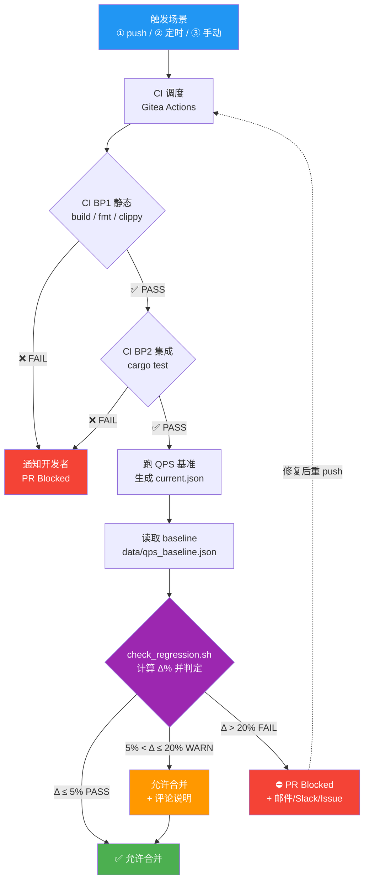
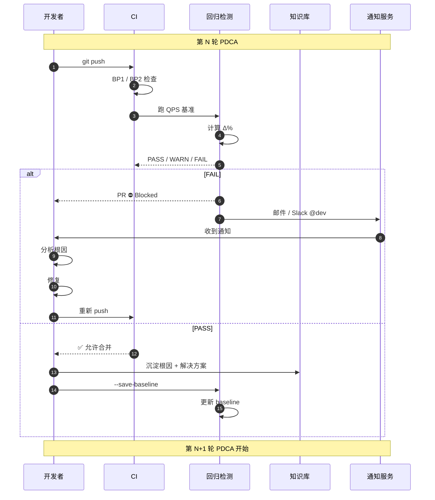

# 回归检测流程图（Regression Detection Flow）

> 实验周次：第 12 周
> 实验类型：回归检测与自优化闭环

---

## 一、ASCII 完整流程图

```
  ┌─────────────────────┐
  │ 1. 触发场景          │
  │                     │
  │ ① 开发者 git push   │
  │ ② 每日定时任务        │
  │ ③ 手动检查           │
  └──────────┬──────────┘
             │
             ▼
  ┌─────────────────────┐
  │ 2. CI 调度           │
  │  Gitea Actions      │
  │  → 触发 ci.yml      │
  │  → Nomad worker     │
  └──────────┬──────────┘
             │
             ▼
  ┌─────────────────────┐
  │ 3. BP1 静态检查       │
  │  build / fmt /     │
  │  clippy            │
  └──────┬──────────────┘
         │
    ┌────┴────┐
    ▼         ▼
  ✅         ❌ ─→ 终止 + 通知
    │
    ▼
  ┌─────────────────────┐
  │ 4. BP2 集成 + 行为   │
  │  cargo test         │
  │  + qps_benchmark    │
  └──────┬──────────────┘
         │
    ┌────┴────┐
    ▼         ▼
  ✅         ❌ ─→ 终止 + 通知
    │
    ▼
  ┌─────────────────────┐
  │ 5. 提取 QPS 数据     │
  │  解析 qps_results.log│
  │  → current.json     │
  └──────┬──────────────┘
         │
         ▼
  ┌─────────────────────┐
  │ 6. 读取 baseline    │
  │  data/qps_baseline │
  │  .json             │
  └──────┬──────────────┘
         │
         ▼
  ┌─────────────────────┐
  │ 7. check_regression │
  │     .sh             │
  │  ────────────────   │
  │  计算 Δ%             │
  │  判定 PASS/WARN/FAIL│
  └──────┬──────────────┘
         │
    ┌────┼────┬──────────┐
    ▼    ▼    ▼          │
  PASS  WARN FAIL        │
    │    │    │          │
    │    │    ▼          │
    │    │  ┌──────────────────┐
    │    │  │ 8a. FAIL 处置     │
    │    │  │                  │
    │    │  │ • PR ⛔ Blocked  │
    │    │  │ • 邮件通知        │
    │    │  │ • Slack @dev    │
    │    │  │ • 创建 Issue    │
    │    │  └────────┬─────────┘
    │    │           │
    │    │           ▼
    │    │     开发者修复
    │    │           │
    │    │           ▼
    │    │     重新 push ──→ 回到 ②
    │    │
    │    ▼
    │  ┌──────────────────┐
    │  │ 8b. WARN 处置     │
    │  │                  │
    │  │ • 允许合并        │
    │  │ • 评论要求说明     │
    │  │ • 标记为可疑 PR   │
    │  └────────┬─────────┘
    │           │
    │           ▼
    │       合并
    │
    ▼
  ┌──────────────────┐
  │ 8c. PASS 处置     │
  │                  │
  │ • ✅ 允许合并    │
  │ • CI 徽章绿      │
  │ • 自动归档数据   │
  └──────────────────┘
```

---

## 二、Mermaid 流程图



---

## 三、PDCA 自优化闭环时序图



---

## 四、回归检测判定矩阵

| Δ% 范围     | 判定    | 退出码 | 处置                     | 阈值来源                    |
| --------- | ----- | --- | ---------------------- | ----------------------- |
| Δ < 0%    | PASS↑ | 0   | ✅ 允许合并 + 自动归档         | 性能提升（好事）                |
| 0% ≤ Δ ≤ 5% | PASS  | 0   | ✅ 允许合并                | 噪声范围（不可控）               |
| 5% < Δ ≤ 20% | WARN  | 2   | ⚠️ 允许合并 + 强制评论说明      | 可疑退化（可能是真实问题）           |
| Δ > 20%   | FAIL  | 1   | ⛔ PR Blocked + 三通道通知    | 严重退化（必须修复）              |

---

## 五、与 PDCA 阶段的对应

| 阶段    | 本流程中的位置          | 关键产物                           |
| ----- | ---------------- | ------------------------------ |
| **Plan** | 触发场景（push / 定时）   | 目标（如 DELETE QPS ≥ 10K）         |
| **Do**   | CI BP1 / BP2     | 代码改动、PR、CI 报告                 |
| **Check**| check_regression.sh | PASS / WARN / FAIL + Δ%        |
| **Act**  | 通知 / 沉淀 / 更新基线   | 知识库条目、新 baseline.json、下一轮目标    |

---

## 六、与现有 Gate 脚本的集成

```
scripts/gate/
├── gate.sh                  ← 总入口
│   ├── check_coverage.sh    ← 覆盖率 ≥ 80%
│   ├── check_security.sh    ← 安全扫描
│   ├── check_docs.sh        ← 文档检查
│   └── check_regression.sh  ← 🆕 本次新增：性能回归
```

集成到 `gate.sh` 的方法：

```bash
# 在 gate.sh 末尾追加
echo "=== Regression Check ==="
scripts/gate/check_regression.sh --skip-run
```

---

## 七、为什么 --skip-run 不能用于 Gate 决策？

| 用途       | --skip-run | 完整跑（默认） |
| -------- | ---------- | -------- |
| 调试脚本逻辑   | ✅ 适用       | ❌ 浪费时间  |
| 复现 Gate 决策 | ✅ 适用       | ❌ 浪费时间  |
| **实际 Gate 决策** | ❌ **绝对不可** | ✅ **唯一可用** |
| 归档基线     | ✅ 适用       | ✅ 都可    |

**原因**：`--skip-run` 永远返回 `current.json = baseline.json`，Δ% 永远 = 0%，永远 PASS。
这等于"不检测"，违背了"通过 Gate 必须有真凭实据"的原则。

---

*最后更新: 2026-05-30*
