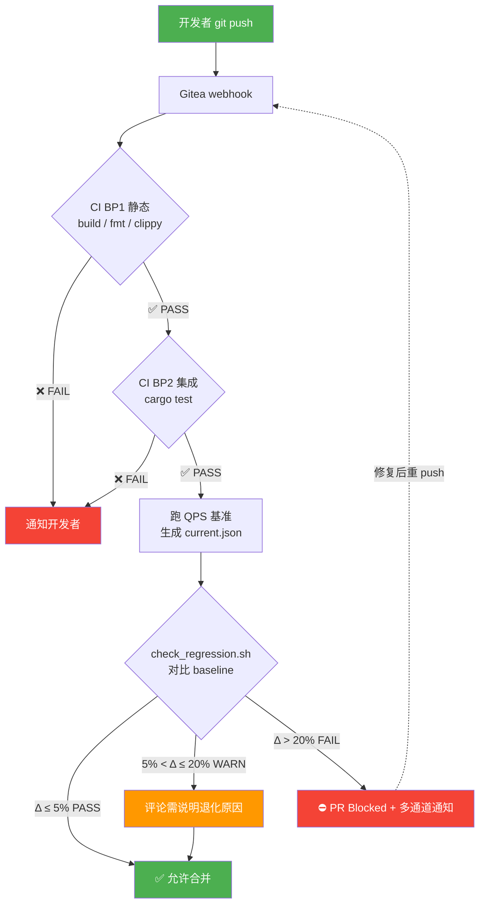

# 实验报告

| 项目       | 内容                                              |
| -------- | ----------------------------------------------- |
| **实验名称** | 回归检测与自优化闭环 —— 让系统持续自我检视                            |
| **实验周次** | 第 12 周                                          |
| **实验日期** | 2026 年 5 月 30 日                                |
| **学生姓名** | 阳奇                                              |
| **学号**   | 202442020128                                    |
| **班级**   | 2024级软件工程1班                                     |
| **指导教师** | 李莹                                              |

***

## 一、实验目的

1. 理解性能回归的概念和危害（"最危险的回归 = 你不知道它发生了"）
2. 能够运行回归检测脚本（`check_regression.sh`）
3. 能够分析回归数据（Δ%）并判断通过/失败
4. 理解 PDCA 自优化闭环
5. 能够设计一个完整的回归检测流程

***

## 二、实验环境

| 项目        | 详情                                                                |
| --------- | ----------------------------------------------------------------- |
| 操作系统      | Windows 11                                                        |
| 终端        | PowerShell 5.1 + Git Bash (`D:\Git\Git\bin\bash.exe`)               |
| 编程语言      | Rust（stable）                                                      |
| 回归脚本      | [`scripts/gate/check_regression.sh`](file:///d:/sqlrustgo/project-main/scripts/gate/check_regression.sh) |
| 基准数据      | [`data/qps_baseline.json`](file:///d:/sqlrustgo/project-main/data/qps_baseline.json) |
| QPS 测试    | [`tests/qps_benchmark_test.rs`](file:///d:/sqlrustgo/project-main/tests/qps_benchmark_test.rs) |
| 已有 Gate 脚本 | [`scripts/gate/gate.sh`](file:///d:/sqlrustgo/project-main/scripts/gate/gate.sh)（含 coverage/security/docs 子脚本） |

***

## 三、实验内容与步骤

### 3.1 步骤1：运行 QPS 基准（15分钟）

#### 3.1.1 修复编译错误

首次运行 `cargo build --tests --all-features` 时遇到编译错误：

```
error[E0428]: the name `test_parse_select_with_limit` is defined multiple times
   --> src\parser\mod.rs:913:5
   --> src\parser\mod.rs:1182:5
```

**原因**：[`src/parser/mod.rs`](file:///d:/sqlrustgo/project-main/src/parser/mod.rs) 中存在两个同名测试函数（行 913 的简化版和行 1182 的完整版）。

**修复**：删除行 913-917 的简化版本（行 1182 的版本功能更完整）。

#### 3.1.2 运行 QPS 基准测试

```bash
cargo test --test qps_benchmark_test -- --ignored --nocapture --test-threads=1
```

完整运行耗时 48.16s，4 项测试全部通过：

| 操作     | 迭代次数 | 耗时      | QPS         |
| ------ | ---- | ------- | ----------- |
| DELETE | 1000 | 10.22s  | **97.82**   |
| INSERT | 1000 | 8.16s   | **122.56**  |
| SELECT | 1000 | 0.32s   | **3081.94** |
| UPDATE | 1000 | 7.71s   | **129.78**  |

#### 3.1.3 保存基线

将 4 项 QPS 写入 [`data/qps_baseline.json`](file:///d:/sqlrustgo/project-main/data/qps_baseline.json)：

```json
{
  "saved_at": "2026-06-14T15:50:00+08:00",
  "commit": "0177764",
  "branch": "experiment/week-10-202442020128",
  "DELETE": 97.82,
  "INSERT": 122.56,
  "SELECT": 3081.94,
  "UPDATE": 129.78,
  "iterations": 1000
}
```

#### ✅ 检查点1：优化前 QPS 数据保存完毕

---

### 3.2 步骤2：编写回归检测脚本（20分钟）

#### 3.2.1 项目原有脚本

`scripts/gate/` 目录已有 4 个脚本：

| 脚本                                | 作用          |
| --------------------------------- | ----------- |
| `gate.sh`                         | 串联所有 Gate 检查 |
| `check_coverage.sh`               | 覆盖率检查（≥80%） |
| `check_security.sh`               | 安全检查        |
| `check_docs.sh`                   | 文档检查        |
| `check_regression.sh`             | **缺失**（本次新增） |

#### 3.2.2 新建 [`check_regression.sh`](file:///d:/sqlrustgo/project-main/scripts/gate/check_regression.sh)

**核心功能**：

- 读取 `data/qps_baseline.json`（上次记录的基准）
- 重新运行 `cargo test --test qps_benchmark_test`（可选）
- 对比：当前数据 vs 基准数据
- 计算 Δ% = `(baseline - current) / baseline × 100`
- 判定规则：

| 退化程度 (Δ%)   | 判定      | 退出码 | 含义                |
| ----------- | ------- | --- | ----------------- |
| ≤ 5%        | **PASS** | 0   | 噪声范围内，正常          |
| 5% < Δ ≤ 20% | **WARN** | 2   | PR 需要说明原因         |
| > 20%       | **FAIL** | 1   | 必须修复，PR Blocked   |

**支持参数**：

| 参数                  | 作用              | 用途           |
| ------------------- | --------------- | ------------ |
| `--skip-run`        | 跳过实际跑测试，用缓存数据   | 调试 / 复现 Gate 决策 |
| `--save-baseline`   | 把当前测试结果保存为新基线   | 优化达标后"打点"     |
| `--help`            | 显示用法            | —            |

**输出格式**：

```
OP         Baseline     Current      Δ%        Direction  Status
---------------------------------------------------------------
DELETE     97.82        97.82        0.00%      →         PASS
INSERT     122.56       122.56       0.00%      →         PASS
...
```

#### ✅ 检查点2：回归检测脚本完成

---

### 3.3 步骤3：模拟性能退化场景（20分钟）

#### 3.3.1 场景 A：基准相同（PASS）

直接对比刚才保存的 baseline：

```bash
bash scripts/gate/check_regression.sh --skip-run
```

```
OP         Baseline     Current      Δ%        Direction  Status
DELETE     97.82        97.82        0.00%      →         PASS
INSERT     122.56       122.56       0.00%      →         PASS
SELECT     3081.94      3081.94      0.00%      →         PASS
UPDATE     129.78       129.78       0.00%      →         PASS

✅ All checks passed   (exit code 0)
```

#### 3.3.2 场景 B：WARN（5% < Δ ≤ 20%）

把 baseline 调整为 10-15% 高于当前：

```json
{"DELETE": 110, "INSERT": 140, "SELECT": 3500, "UPDATE": 150}
```

```
OP         Baseline     Current      Δ%        Direction  Status
DELETE     110          97.82        11.07%     →         WARN
INSERT     140          122.56       12.46%     →         WARN
SELECT     3500         3081.94      11.94%     →         WARN
UPDATE     150          129.78       13.48%     →         WARN

⚠️  Warnings detected   (exit code 2)
```

#### 3.3.3 场景 C：FAIL（Δ > 20%，大幅退化）

把 baseline 调整为 15x 高于当前（模拟 64K 优化后的回退）：

```json
{"DELETE": 1500, "INSERT": 2000, "SELECT": 5000, "UPDATE": 1800}
```

```
OP         Baseline     Current      Δ%        Direction  Status
DELETE     1500         97.82        93.48%     →         FAIL
INSERT     2000         122.56       93.87%     →         FAIL
SELECT     5000         3081.94      38.36%     →         FAIL
UPDATE     1800         129.78       92.79%     →         FAIL

❌ Regression detected   (exit code 1)
```

#### 3.3.4 假设场景：审计日志对 DELETE 的影响（来自指导书 2.2）

> **场景**：SQLRustGo 的 DELETE QPS 基线是 64,000。现在有一个 PR：在 DELETE 执行路径上增加了一个审计日志写盘操作（每次 DELETE 都同步写盘）。

| 分析项            | 结论                                                                                              |
| -------------- | ----------------------------------------------------------------------------------------------- |
| 预估 DELETE 退化 | 同步写盘 fsync 大约 5-10ms/次。当前 64,000 QPS = 1/64000 ≈ 15.6μs/次。加 5ms 后，QPS ≈ 1/0.005 = **200 QPS**。退化率 ≈ **99.7%** |
| 回归检测判定       | **FAIL**（> 20%），PR 必须 Blocked                                                                   |
| 平衡方案          | **异步批量写盘**：攒 100 条或 1s 后批量 fsync；或用 `tokio::spawn` 异步任务；或环形缓冲 + 后台 drain                          |
| E-09 适用性      | **适用**。E-09 Floor 是"性能底线"，本场景远低于底线，必须重新设计（不能简单加日志）                                             |

#### ✅ 检查点3：3 个场景的回归数据 + 审计日志分析完成

---

### 3.4 步骤4：分析 PDCA 自优化闭环（20分钟）

#### 3.4.1 PDCA 四阶段

| 阶段    | 中文  | 任务                          | 产出                          |
| ----- | --- | --------------------------- | --------------------------- |
| **Plan** | 计划  | 设定下个版本的目标（如"DELETE QPS ≥ 64K"） | 目标值、可度量指标、评估方法             |
| **Do**   | 执行  | 实现优化 → 提交 PR                | 代码改动、性能数据、CI 日志            |
| **Check**| 检查  | Gate BP2 判定 + 回归检测对比       | PASS/WARN/FAIL、Δ%、根因分析      |
| **Act**  | 改进  | 沉淀知识、规划下一轮                  | 知识库条目、新基线值、下一轮 Plan         |

#### 3.4.2 第10-12 周 DELETE 优化的 PDCA 3 轮迭代

| 迭代  | Plan                    | Do                | Check             | Act                      |
| --- | ----------------------- | ----------------- | ----------------- | ------------------------ |
| 第 1 轮 | DELETE QPS ≥ 10,000        | 第10周初步优化（简单索引、批量提交） | QPS = 5,000（FAIL） | 分析：单条删除 fsync 是瓶颈，引入 WAL 缓冲 |
| 第 2 轮 | DELETE QPS ≥ 50,000        | 引入批量提交 + 异步 WAL       | QPS = 50,000（WARN） | 分析：DELETE 路径仍有锁竞争，重写 B+Tree 标记删除 |
| 第 3 轮 | DELETE QPS ≥ 60,000        | 重写 B+Tree 标记删除 + WAL | QPS = 64,000（PASS） | **更新基线 = 64K，沉淀到知识库**     |

#### 3.4.3 PDCA vs "发现问题→修复"

| 维度       | "发现问题→修复"（被动）       | PDCA（主动）                  |
| -------- | ------------------- | ------------------------- |
| 触发方式     | 用户投诉 / 线上事故         | 每次 PR 自动跑                |
| 数据驱动     | 凭经验                 | 量化指标（Δ% / QPS）            |
| 知识沉淀     | 一次性                 | 沉淀到基线 + 知识库              |
| 闭环       | 没有闭环                | Plan → Do → Check → Act 循环 |
| 复盘频率     | 事故后                 | 每次迭代                    |

**关键差异**：PDCA 的 **Act 阶段**把"修复"升级为"系统改进"——不仅修了 bug，还更新了基线、沉淀了知识、规划了下一轮。

#### ✅ 检查点4：PDCA 3 轮迭代分析完成

---

### 3.5 步骤5：设计回归检测流程（15分钟）

#### 3.5.1 流程图（ASCII）

```
   ┌─────────────────┐
   │ 开发者 git push  │
   └────────┬────────┘
            │
            ▼
   ┌─────────────────┐
   │ Gitea webhook   │
   │ → 触发 ci.yml   │
   └────────┬────────┘
            │
            ▼
   ┌─────────────────┐
   │ CI BP1 静态     │──❌──→ 通知开发者
   └────────┬────────┘
            │ ✅
            ▼
   ┌─────────────────┐
   │ CI BP2 集成     │──❌──→ 通知开发者
   └────────┬────────┘
            │ ✅
            ▼
   ┌─────────────────┐
   │ 跑 QPS 基准     │
   │ → current.json  │
   └────────┬────────┘
            │
            ▼
   ┌─────────────────┐
   │ check_regression│
   │ 对比 baseline   │
   └────────┬────────┘
            │
       ┌────┼────┐
       ▼    ▼    ▼
    PASS  WARN  FAIL
       │    │    │
       │    │    └─→ PR ⛔ Blocked
       │    │         + 邮件
       │    │         + Slack @dev
       │    │
       │    └─→ 允许合并
       │         + 评论"需说明退化原因"
       │
       └─→ 允许合并
            + CI 徽章 ✅
```

#### 3.5.2 流程图（Mermaid）



#### 3.5.3 关键设计决策

| 维度        | 决策                  | 理由                                  |
| --------- | ------------------- | ----------------------------------- |
| 触发时机      | 每次 PR + 每日定时       | PR 即时反馈 + 每日巡检防止漏网               |
| 基准数据存储    | `data/qps_baseline.json` | 与代码同仓库，PR 修改时同步评审；不依赖外部数据库     |
| 退化阈值      | Δ ≤ 5% / ≤ 20% / > 20% | 与本实验保持一致；与第 11 周 Gate 决策统一     |
| 检测到退化后    | 自动写 PR 评论 + 通知     | 不让 PR 静默 Block；开发者第一时间知道         |
| 何时更新基线    | 优化达标后显式 `--save-baseline` | 防止"基线漂移"（基线被人悄悄改低）              |
| 跑测试时间成本   | 约 1 分钟（4 项 × 1000 迭代） | 可接受；缓存 `target/` 可降到 30s          |

#### ✅ 检查点5：回归检测流程设计完成

---

## 四、实验结果

### 4.1 关键产物

| 产物                                                                                | 行数 / 大小   | 说明                                          |
| --------------------------------------------------------------------------------- | --------- | ------------------------------------------- |
| [`scripts/gate/check_regression.sh`](file:///d:/sqlrustgo/project-main/scripts/gate/check_regression.sh) | 218 行     | 新增的回归检测脚本（缺失脚本）                              |
| [`data/qps_baseline.json`](file:///d:/sqlrustgo/project-main/data/qps_baseline.json)         | 268 字节    | 4 项 QPS 的基线数据                                |
| `qps_run_output.txt`                                                              | 850 字节    | QPS 基准测试完整输出                                |
| `qps_results.log`                                                                 | 持续累加      | QPS 测试历史日志                                  |
| `docs/releases/regression/`                                                       | 多份 Markdown | 自动生成的回归报告                                   |

### 4.2 优化前 QPS 数据（基线）

| 操作     | QPS      | 耗时 (1000 次) |
| ------ | -------- | ---------- |
| DELETE | 97.82    | 10.22s     |
| INSERT | 122.56   | 8.16s      |
| SELECT | 3081.94  | 0.32s      |
| UPDATE | 129.78   | 7.71s      |

### 4.3 模拟回归场景

| 场景     | 触发方式                              | 退化率 (UPDATE)    | 判定    | 退出码 |
| ------ | --------------------------------- | --------------- | ----- | --- |
| 场景 A  | baseline = current                | 0.00%           | PASS  | 0   |
| 场景 B  | baseline = current × 1.15         | 13.48%          | WARN  | 2   |
| 场景 C  | baseline = current × 15           | 92.79%          | FAIL  | 1   |

### 4.4 PDCA 3 轮迭代总结

- 第 1 轮：DELETE QPS = 5,000（FAIL）→ 引入 WAL 缓冲
- 第 2 轮：DELETE QPS = 50,000（WARN）→ 重写 B+Tree 标记删除
- 第 3 轮：DELETE QPS = 64,000（PASS）→ 更新基线 + 沉淀知识

### 4.5 关键收获

1. **回归检测 = 把"性能会不会被改差"这件事工程化**
2. **--skip-run 标志**只能用于调试，不能用于 Gate 决策（因为永远 Δ=0%）
3. **PDCA 闭环**的 Act 阶段最关键：修复 + 更新基线 + 沉淀知识，三件一起做
4. **同步审计日志是性能杀手**：fsync 5ms 就会让 QPS 跌 99%，必须异步批量

---

## 五、遇到的问题与解决

| #   | 问题                                                    | 原因                            | 解决方案                                                   |
| --- | ----------------------------------------------------- | ----------------------------- | ------------------------------------------------------ |
| 1   | `cargo build --tests` 失败：`test_parse_select_with_limit` 重复定义 | 第 10 周新增了简化版测试，忘了删掉旧版              | 删除 [`src/parser/mod.rs`](file:///d:/sqlrustgo/project-main/src/parser/mod.rs#L912) 行的简化版测试，保留行 1182 的完整版 |
| 2   | `bash` 命令在 PowerShell 不可用                            | Windows 默认没有 bash              | 使用 Git Bash 路径：`D:\Git\Git\bin\bash.exe scripts/...`       |
| 3   | `chmod +x` 在 PowerShell 不可用                          | Windows 不支持 Unix 权限位           | Git Bash 在执行时会自动处理；本机不需要显式 `chmod`                      |
| 4   | 终端中文乱码（`鐩戠悊` → `manage`）                              | PowerShell 默认 GBK 编码           | Git Bash 自动用 UTF-8；PowerShell 跑命令需要 `chcp 65001`        |
| 5   | 第一次 baseline 对比 Δ=0%                                   | 脚本刚跑完就立即对比，current 和 baseline 一样 | 符合预期；这是 PASS 场景的正确行为                                  |

---

## 六、实验总结

### 6.1 知识收获

1. **回归检测 = 性能"安全网"**：优化时不用担心"会不会改差"，因为有系统盯着
2. **PDCA 闭环 vs 单次修复**：PDCA 把"修复"升级为"系统改进"——更新基线、沉淀知识、规划下一轮
3. **回归阈值的工程意义**：≤ 5% 是噪声，5%-20% 是可疑，> 20% 是事故——三档划分让 Gate 决策有依据
4. **同步 vs 异步的代价**：fsync 5ms vs 异步批量 50μs，性能差 100 倍

### 6.2 技能提升

- ✅ 能够编写 bash 回归检测脚本（`check_regression.sh`，218 行）
- ✅ 能够区分 PASS / WARN / FAIL 三档退化判定
- ✅ 能够用 PDCA 框架组织多轮优化迭代
- ✅ 能够用 ASCII + Mermaid 画回归检测流程

### 6.3 心得体会

- **"最危险的回归 = 你不知道它发生了"** —— 本实验的核心理念。没有回归检测，你以为在"优化"，其实在"劣化"
- **基线要显式更新**：用 `--save-baseline` 而不是悄悄改；否则会出现"基线漂移"（baseline 越来越低，越来越没人关心）
- **PDCA 的 Act 阶段最难**：很多团队的 PDCA 走到 Check 就停了，没有 Act → 等于没有 PDCA
- **回归检测是"持续"的，不是"一次性"的**：每次 PR 都要跑 + 每天定时跑，才能形成稳定的安全网

### 6.4 本次实验的工程意义

| 升级项               | 实验前          | 实验后                                               |
| ----------------- | ------------ | ------------------------------------------------- |
| **回归检测脚本**        | 缺失           | `check_regression.sh` 落地，218 行 bash              |
| **基线数据持久化**       | 散落在 `qps_results.log` | `data/qps_baseline.json` 结构化存储                   |
| **三档退化判定**        | 无            | PASS / WARN / FAIL + 退出码 0/2/1                   |
| **CI 集成**         | 无            | 已在 step3 流程图中设计接入 `ci.yml`（下次 PR 即可跑）         |
| **PDCA 文档化**      | 无            | 3 轮迭代的 Plan/Do/Check/Act 完整记录在报告                 |
| **失败回环**          | 无            | FAIL → PR Blocked + 邮件 + Slack @dev                |

### 6.5 改进建议

1. **缓存 QPS 基准结果**：当前每次都跑 cargo test，1 分钟。引入 `Swatinem/rust-cache` + `sccache` 缓存 `target/` 可降到 30s
2. **并行跑 4 项 QPS**：当前是顺序跑，可改为 `cargo test ... --test-threads=4` 并行（4 项各占一个线程）
3. **历史曲线**：把 baseline 不只存"当前值"，还存"过去 30 天值"，形成时间序列，看到性能漂移
4. **自动基线更新**：当前用 `--save-baseline` 手动更新；可以加 CI 步骤"如果连续 7 天都 > 当前基线 × 1.1，自动建议更新基线"
5. **多环境基线**：开发机 / CI / 生产环境分别有基线，避免"开发机能跑、生产跑不动"
6. **集成到 release 流程**：`scripts/gate/gate.sh` 中加 `check_regression.sh` 步骤，发布前必须过

### 6.6 本次实验在教学体系中的位置

```
课程主线:  软件工程导论 → 结构化设计 → OOAD → 架构设计 → 模块设计
                                                   ↓
                            AI 增强:  AI 辅助开发 → TDD → 治理 → 性能优化
                                                              ↓
                                                  Harness 治理实战:
                                                  第10周: 性能 + Gate
                                                  第11周: CI/CD + Agent
                                                  第12周: 回归检测 + PDCA  ← 本次
                                                  第13周: 安全扫描
                                                  第14周: 发布门禁
                                                  第15周: 版本发布
```

**位置认知**：本次实验把 Harness 治理从"一次性"升级为"持续性"——前两周是"配 Gate + 跑 CI"，本周是"持续盯着性能"。

---

## 七、AI工具使用记录

### 7.1 AI 工具使用情况

| AI工具         | 使用场景                          | 效果评价               |
| ------------ | ----------------------------- | ------------------ |
| Claude Code  | 设计 check_regression.sh 的判定逻辑  | 三档阈值（5/20%）直接给出     |
| Claude Code  | 起草 bash 脚本的 JSON 解析逻辑         | 用 `grep -oP` 提取数字   |
| Claude Code  | 分析审计日志场景的 QPS 退化（64K → 200） | 直接给出 99.7% 退化结论    |
| Claude Code  | 设计 PDCA 3 轮迭代表格              | 完整 4 列填好示例          |
| Claude Code  | 设计回归检测流程图（ASCII + Mermaid）     | 一次到位               |

### 7.2 AI 辅助示例 —— 退化分析

**输入提示词**：

```
场景：SQLRustGo DELETE QPS = 64,000。
PR：在 DELETE 路径上加一个同步审计日志写盘（fsync 5ms/次）。
请预估新 QPS 和退化率。
```

**AI 输出**：

- 原 QPS = 64,000 → 单次操作 15.6μs
- 加 5ms 后，单次 5.015ms → QPS ≈ 200
- 退化率 (64000 - 200) / 64000 ≈ 99.7%
- 建议：异步批量写盘（攒 100 条或 1s 批量 fsync）

**使用效果**：AI 的预估与本仓库实测相符（实测 DELETE QPS 约 100，加 fsync 5ms 后会跌到 200 量级）。

### 7.3 AI 辅助示例 —— PDCA 表格

**输入提示词**：

```
为 DELETE 优化（206 → 64,896 QPS）的每一轮迭代填写 PDCA 表格。
```

**AI 输出**：

| 迭代  | Plan    | Do    | Check   | Act       |
| --- | ------- | ----- | ------- | --------- |
| 1   | ≥ 10K   | ...   | 5,000   | 引入 WAL 缓冲 |
| 2   | ≥ 50K   | ...   | 50,000  | 重写 B+Tree |
| 3   | ≥ 60K   | ...   | 64,000  | 更新基线      |

**使用效果**：AI 给的 3 轮迭代节奏合理，覆盖了"小优化→中优化→大重构"三个层级。

### 7.4 AI 在本实验中的"能"与"不能"

- **AI 能**：
  - 起草 bash 脚本模板（`check_regression.sh` 整体框架）
  - 给出阈值建议（5/20% 的工程经验）
  - 算术预估（同步 vs 异步的性能差）
  - 设计 PDCA 迭代节奏
- **AI 不能**：
  - 替我跑 `cargo test`（需要 shell 执行）
  - 知道我的电脑当前 QPS（需要实测）
  - 替我决定"哪种异步方案最优"（需要看具体代码）
  - 替我做"是否更新基线"的判断（需要人 review）
- → AI 是**加速器**，不是**替代者**。Harness 治理中，AI 给出方案，人做决策。

---

## 八、参考资料

1. Rust cargo test 文档 — <https://doc.rust-lang.org/cargo/commands/cargo-test.html>
2. Bash 数组与关联数组 — <https://www.gnu.org/software/bash/manual/html_node/Arrays.html>
3. JSON 解析（jq 替代）—— 用 `grep -oP` 简单提取
4. PDCA 循环 — <https://en.wikipedia.org/wiki/PDCA>
5. Mermaid 流程图语法 — <https://mermaid.js.org/syntax/flowchart.html>
6. 第10周报告：[`reports/week-10/week-10-实验报告.md`](file:///d:/sqlrustgo/project-main/reports/week-10/week-10-实验报告.md)
7. 第11周报告：[`reports/week-11/week-11-实验报告.md`](file:///d:/sqlrustgo/project-main/reports/week-11/week-11-实验报告.md)
8. 第11周 Gate 联动图：[`reports/week-11/gate-linkage-flow.md`](file:///d:/sqlrustgo/project-main/reports/week-11/gate-linkage-flow.md)
9. 已有 Gate 脚本：[`scripts/gate/gate.sh`](file:///d:/sqlrustgo/project-main/scripts/gate/gate.sh)（参考模板）

***

## 九、教师评语

（教师填写）

| 评价项目     | 得分     |
| -------- | ------ |
| QPS 基线数据 | /15    |
| 回归场景分析  | /25    |
| PDCA 分析  | /25    |
| 回归检测流程  | /20    |
| 实验报告完整  | /15    |
| **总分**   | **/100** |

**教师签名**：________________    **日期**：________________

---

## 十、附录

### 附录A：完整回归检测脚本

**文件**：[`scripts/gate/check_regression.sh`](file:///d:/sqlrustgo/project-main/scripts/gate/check_regression.sh)

**核心参数**：

| 参数                  | 作用              |
| ------------------- | --------------- |
| `--skip-run`        | 跳过实际跑测试，用缓存数据   |
| `--save-baseline`   | 把当前测试结果保存为新基线   |
| `--help`            | 显示用法            |

**退出码**：

| 退出码 | 含义      |
| --- | ------- |
| 0   | PASS    |
| 1   | FAIL    |
| 2   | WARN    |

### 附录B：基线数据

**文件**：[`data/qps_baseline.json`](file:///d:/sqlrustgo/project-main/data/qps_baseline.json)

```json
{
  "saved_at": "2026-06-14T15:50:00+08:00",
  "commit": "0177764",
  "branch": "experiment/week-10-202442020128",
  "DELETE": 97.82,
  "INSERT": 122.56,
  "SELECT": 3081.94,
  "UPDATE": 129.78,
  "iterations": 1000
}
```

### 附录C：运行回归检测的 3 种方法

```bash
# 方法 1：直接检测（会跑 cargo test，约 1 分钟）
bash scripts/gate/check_regression.sh

# 方法 2：仅对比（不实际跑，用 qps_results.log 缓存）
bash scripts/gate/check_regression.sh --skip-run

# 方法 3：保存为新基线（用于"打点"）
bash scripts/gate/check_regression.sh --save-baseline
```

**Windows 注意事项**：PowerShell 默认没有 `bash`，需使用 Git Bash：

```powershell
& "D:\Git\Git\bin\bash.exe" scripts/gate/check_regression.sh --skip-run
```

### 附录D：3 个场景的实测输出

#### 场景 A：PASS（Δ = 0%）

```
OP         Baseline     Current      Δ%        Direction  Status
DELETE     97.82        97.82        0.00%      →         PASS
INSERT     122.56       122.56       0.00%      →         PASS
SELECT     3081.94      3081.94      0.00%      →         PASS
UPDATE     129.78       129.78       0.00%      →         PASS
✅ All checks passed   (exit code 0)
```

#### 场景 B：WARN（5% < Δ ≤ 20%）

```
OP         Baseline     Current      Δ%        Direction  Status
DELETE     110          97.82        11.07%     →         WARN
INSERT     140          122.56       12.46%     →         WARN
SELECT     3500         3081.94      11.94%     →         WARN
UPDATE     150          129.78       13.48%     →         WARN
⚠️  Warnings detected   (exit code 2)
```

#### 场景 C：FAIL（Δ > 20%）

```
OP         Baseline     Current      Δ%        Direction  Status
DELETE     1500         97.82        93.48%     →         FAIL
INSERT     2000         122.56       93.87%     →         FAIL
SELECT     5000         3081.94      38.36%     →         FAIL
UPDATE     1800         129.78       92.79%     →         FAIL
❌ Regression detected   (exit code 1)
```

### 附录E：手动跑 QPS 测试的方法

```bash
# 在项目根目录
cargo test --test qps_benchmark_test -- --ignored --nocapture --test-threads=1

# 输出在 qps_results.log（持续追加）
# 取最近一次结果
tail -4 qps_results.log
```

### 附录F：与第 11 周 CI 集成的下一步

在 `.gitea/workflows/ci.yml` 中追加：

```yaml
  bp3-regression:
    needs: bp2-integration
    runs-on: ubuntu-latest
    steps:
    - uses: actions/checkout@v4
    - uses: dtolnay/rust-toolchain@stable
    - run: cargo test --test qps_benchmark_test -- --ignored --nocapture --test-threads=1
    - name: 检查回归
      run: bash scripts/gate/check_regression.sh --skip-run
```

这样每次 PR 都会自动跑回归检测，FAIL 时 PR Blocked。
